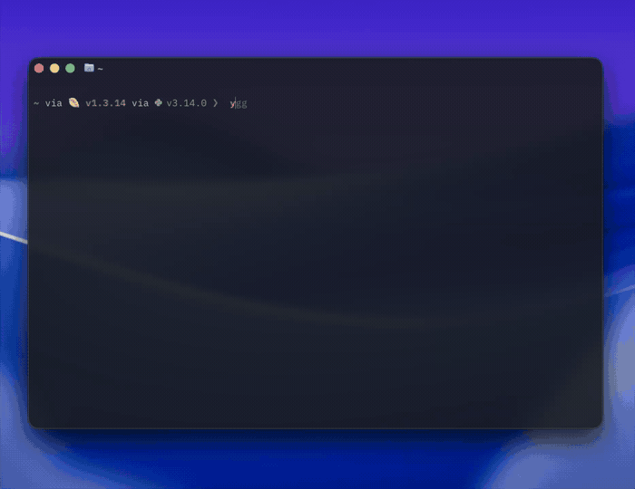
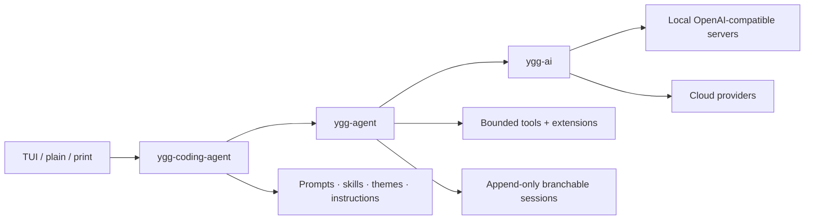

<p align="center">
  <a href="http://skaft.org/ygg">
    
  </a>
</p>

<p align="center">
  <strong>A tiny and fast coding agent for local models, cloud models, and everything in between.</strong>
</p>

<p align="center">
  <a href="http://skaft.org/ygg"><strong>Website</strong></a> ·
  <a href="http://skaft.org/ygg/#install"><strong>Install</strong></a> ·
  <a href="http://skaft.org/ygg/docs"><strong>Documentation</strong></a> ·
  <a href="SECURITY.md"><strong>Security</strong></a>
</p>

<p align="center">
  
  
  
  <a href="LICENSE"></a>
</p>

---

ygg is a local-first coding agent written in Rust. It combines a polished terminal interface, a provider-agnostic inference layer, durable sessions, explicit tools, omnimodal input, configurable compaction, and a rich, customizable theme engine.

It works with a local OpenAI-compatible server just as naturally as it works with OpenAI, Anthropic, OpenRouter, or another cloud provider. There is no hosted ygg control plane: model traffic goes directly from your machine to the endpoint you select, and sessions remain local inspectable JSONL.

> **Release status:** `0.1.1-alpha`. The safety, persistence, protocol, and terminal invariants are covered by more than 1,000 automated tests, but configuration and public APIs may still change before 1.0. ygg is a trusted local agent, not an operating-system sandbox.

## Why ygg

Most coding agents make you choose between a beautiful product and a system you can actually inspect. ygg is built around the idea that you should get both.

| Principle | What it means in ygg |
| --- | --- |
| **Local models first** | First-class custom endpoints, offline startup, cold-start-safe timeouts, live model discovery, and exact endpoint-reported reasoning controls. |
| **One conversation model** | OpenAI Chat Completions, OpenAI Responses, and Anthropic Messages share one typed request, message, tool, usage, and streaming model. |
| **Durable by construction** | Sessions are append-only, parent-linked, branchable, locked, synced, repairable, and inspectable without ygg running. |
| **Authority is explicit** | Workspace trust, tool allowlists, mutation controls, command controls, bounded I/O, and extension trust are visible user decisions. |
| **The terminal is the product** | Native scrollback and selection, semantic rendering, ten bundled themes, responsive narrow layouts, stable streaming, and plain-output fallbacks. |
| **Customization is local data** | Prompts, skills, themes, instructions, and extensions are ordinary files with deterministic precedence and reloadable snapshots. |

## Install

ygg currently supports macOS and Linux. You need [Rust 1.86 or newer](https://rustup.rs/) and [ripgrep](https://github.com/BurntSushi/ripgrep).

### Installer

The installer builds the pinned alpha tag and adds Cargo's binary directory to zsh, bash, or POSIX sh when necessary:

```sh
curl --proto '=https' --tlsv1.2 -LsSf \
  https://raw.githubusercontent.com/skaft-software/ygg/v0.1.1-alpha/scripts/install.sh | sh
```

Restart the shell, then verify the installation:

```sh
ygg --version
ygg --help
```

### Cargo

To install without changing a shell startup file:

```sh
cargo install --locked \
  --git https://github.com/skaft-software/ygg \
  --tag v0.1.1-alpha \
  --bin ygg \
  ygg-coding-agent
```

Ensure Cargo's binary directory is on `PATH`:

```sh
export PATH="${CARGO_HOME:-$HOME/.cargo}/bin:$PATH"
```

### From a checkout

```sh
git clone https://github.com/skaft-software/ygg.git
cd ygg
cargo install --locked --path crates/ygg-coding-agent --bin ygg
```

### Container

The included image builds ygg from the locked workspace, runs as an unprivileged
user, and expects an explicit workspace mount:

```sh
docker build -f deploy/Dockerfile.ygg -t ygg:alpha .
docker run --rm -it \
  -e ANTHROPIC_API_KEY \
  -v "$PWD:/workspace" \
  ygg:alpha --model claude-sonnet-4-6
```

Only pass credentials and mount paths the container actually needs.

## Quick start

### Use a cloud model

Set the provider credential, then select a model. ygg discovers the live model catalog where the provider exposes one.

```sh
export ANTHROPIC_API_KEY='...'
ygg --model claude-sonnet-4-6
```

```sh
export OPENAI_API_KEY='...'
ygg --model gpt-5.4
```

```sh
export OPENROUTER_API_KEY='...'
ygg --model openrouter/anthropic/claude-sonnet-4.6
```

ChatGPT subscription users can use the hosted device flow instead of manually managing an API key:

```sh
ygg --login codex
ygg --model gpt-5.6
```

### Use a local model

Create `~/.ygg/credentials/custom.json`:

```json
{
  "base_url": "http://127.0.0.1:8000/v1/",
  "api_key": "",
  "auto_discover": true,
  "startup_timeout_secs": 900
}
```

Protect the credential file and start ygg:

```sh
chmod 600 ~/.ygg/credentials/custom.json
ygg --model custom/my-model
```

`startup_timeout_secs` applies to the initial response headers from a cold custom endpoint, so a local server can load model weights without being mistaken for a dead connection. Ordinary connection loss remains bounded, visible, cancellable, and retried up to five times.

If the endpoint cannot provide a useful `GET /models`, configure its inventory explicitly:

```json
{
  "base_url": "http://127.0.0.1:8000/v1/",
  "api_key": "",
  "auto_discover": false,
  "startup_timeout_secs": 900,
  "models": [
    {
      "api_name": "Qwen/Qwen3-Coder-Next",
      "display_name": "Qwen3 Coder Next",
      "context_window": 131072,
      "max_output_tokens": 16384,
      "tools": true,
      "parallel_tool_calls": false,
      "vision": false,
      "structured_output": false,
      "reasoning": true,
      "reasoning_values": ["none", "default"],
      "reasoning_default": "default"
    }
  ]
}
```

Use `--offline` to skip optional model discovery during startup. Inference still reaches the selected endpoint.

## What ships in the binary

### Three frontends

| Mode | Command | Best for |
| --- | --- | --- |
| Interactive TUI | `ygg` | Daily work: streaming, tools, themes, pickers, branching, steering, and native scrollback. |
| Chronological plain mode | `ygg --plain` | Basic terminals, logs, accessibility tooling, and environments where cursor control is undesirable. |
| Response-only print mode | `ygg -p "prompt"` | Shell composition and scripts that want the final response on stdout. |

All three frontends use the same agent loop, provider layer, session format, safety policy, and cancellation behavior.

### Built-in tools

| Tool | Purpose | Default |
| --- | --- | --- |
| `read` | Bounded text reads with line-oriented output. | On |
| `edit` | Exact, stale-aware replacements within the workspace policy. | On |
| `write` | Create or replace complete files within the workspace policy. | On |
| `bash` | Run commands through a Bash-compatible shell with bounded output, timeout, cancellation, and process-group cleanup. | On |
| `search` | Ripgrep-backed workspace search. | Opt-in |

The model-visible schema and executable registry are built from the same final policy. A disabled tool cannot remain advertised to the model.

```sh
# Read-only review
ygg --tools read,search --no-context-files --offline

# No file mutation
ygg --no-edit

# No command execution
ygg --no-process

# No tools at all
ygg --no-tools
```

`bash` runs with the authority of the current operating-system user. Like Pi, it
passes every complete command to one selected shell with `-c`; on Unix Ygg uses
an explicit `shell_path` first, then `/bin/bash`, `bash` on `PATH`, and finally
`sh`. It does not consult `$SHELL`. `--no-process` and `--no-shell` are
equivalent authority gates. For untrusted repositories, use a container, VM, or
restricted account; see [SECURITY.md](SECURITY.md).

### Provider and protocol support

| Protocol | Streaming | Tools | Reasoning | Images | Structured output |
| --- | :---: | :---: | :---: | :---: | :---: |
| OpenAI Responses | ✓ | ✓ | ✓ | ✓ | ✓ |
| OpenAI Chat Completions | ✓ | ✓ | ✓ | ✓ | ✓ |
| Anthropic Messages | ✓ | ✓ | ✓ | ✓ | ✓ |

Built-in provider presets include OpenAI, Anthropic, OpenRouter, DeepSeek, Groq, Cerebras, xAI, Together AI, Fireworks AI, NVIDIA, Hugging Face, Moonshot AI, Xiaomi, MiniMax, and OpenCode Zen. Custom OpenAI-compatible endpoints cover local servers such as llama.cpp, vLLM, SGLang, LM Studio, and compatible gateways.

Capability handling is model-specific. ygg validates modalities, tool use, structured output, output limits, and reasoning before sending a request. When a custom endpoint reports an exact reasoning control—off-only, binary on/off, or named levels—the picker and request wire values follow that metadata exactly.

### Reasoning without transcript noise

Reasoning is collapsed by default while remaining available with `Ctrl+O`. During generation, the compact indicator uses the active model's lab color; when complete it settles into a quiet elapsed-time label.

```text
⠹ thinking
└ ctrl+o to expand

thought for 14s
└ ctrl+o to expand
```

Select a supported level at launch or while the session is running:

```sh
ygg --reasoning high
```

```text
/thinking off
/thinking on
/thinking minimal
/thinking low
/thinking medium
/thinking high
/thinking xhigh
/thinking max
```

The available choices are narrowed to the selected model. Token-budget reasoning is also available for compatible models with `--reasoning budget=N`.

### Multimodal prompts

Paste or mention a supported image in the composer. Attachments are represented as explicit chips, remain ordered with text, and are accepted only when the selected model advertises the required input modality. Unsupported media stays visible as a path plus a diagnostic rather than being silently discarded.

### Durable branchable sessions

ygg sessions are bounded append-only JSONL, namespaced by workspace. Complete semantic boundaries are persisted; provisional streaming deltas are not. Each entry points to its parent, which makes checkout and branching cheap without rewriting history.

```sh
ygg --continue
ygg --resume
ygg --resume SESSION_ID

ygg sessions list
ygg sessions list --query parser
ygg sessions inspect SESSION_ID
ygg sessions rename SESSION_ID "parser hardening"
ygg sessions tag SESSION_ID rust local-model
ygg sessions export SESSION_ID --output ./handoff.ygg-session.json
ygg sessions delete SESSION_ID
ygg sessions repair SESSION_ID
```

- Session listing is read-only and uses lightweight bounded metadata scans.
- Deletion moves data into a recoverable trash directory.
- Repair only removes an interrupted final append and writes a private backup first.
- Export validates the session and redacts credential-like values by default.
- A dropped run never silently replays an unresolved mutating tool call.
- Resume restores the selected model, reasoning, prompt identity, tool panels, branches, and historical prompt colors.

See [docs/sessions.md](docs/sessions.md) for the record schema, branch semantics, redaction contract, and recovery behavior.

### Context and compaction

ygg estimates the next provider-visible request against the active model's context window. At the configured threshold it creates a bounded summary at a safe completed-turn boundary, preserves recent turns, and keeps active skill state. Compaction can use the active model or a separately configured model.

```toml
[compaction]
threshold_fraction = 0.85
keep_recent_turns = 4
compact_model = "openrouter/anthropic/claude-haiku-4.5"
```

Run `/compact` at any time to request a manual compaction. The compact footer uses the latest provider turn's authoritative usage rather than cumulative traffic.

## Terminal experience

ygg's TUI is built on a vendored, terminal-correct Rust renderer. It treats native terminal behavior as a feature, not an implementation detail.

- Native scrollback and text selection by default; application-owned mouse behavior is opt-in.
- Stable-prefix differential rendering, synchronized atomic frames, and bounded repaint regions.
- Responsive wide and narrow layouts with Unicode, ASCII, truecolor, 256-color, 16-color, and no-color fallbacks.
- Semantic tool intent/lifecycle states, rich Markdown, syntax highlighting, tables, task lists, and links; raw tool evidence is never rendered.
- Prompt colors tied to model labs in the default theme; named themes retain their own authored palettes.
- Exact theme replacement: switching back to default does not retain attributes from the previous theme.
- Ten bundled themes: `bone-machine`, `circuit-garden`, `field-notes`, `oxide-console`, `paper-ledger`, `signal-noir`, `synthwave-relay`, `tidepool`, `violet-hour`, and `zen-mono`.
- Terminal control-sequence sanitization in user- and provider-controlled text.

Tool arguments, raw/progress output, failure details, diffs, shell output, and
extension-rendered tool payloads remain internal accountability evidence. Ctrl+O
only expands reasoning or compaction summaries; `/tool` and `/verbose` never
disclose tool evidence. Final structured tool results are retained and sent to
the provider only when required to continue the tool protocol; live progress
is neither persisted nor sent to the model.

```sh
ygg --theme violet-hour
ygg --color auto
ygg --mouse terminal
```

Custom themes are local TOML files and can control semantic roles, glyphs, density, responsive breakpoints, transcript surfaces, and terminal capability fallbacks. See [docs/themes.md](docs/themes.md).

## Interactive command reference

Type `/` in the composer to open live command discovery.

| Command | Purpose |
| --- | --- |
| `/new` | Start a fresh conversation. |
| `/resume [id]` | Open the session picker or resume a session. |
| `/tree` | Show the complete conversation branch tree. |
| `/checkout <id>` | Move the durable head to another entry and branch from it. |
| `/model [id]` | Open the model picker or select a model. |
| `/cycle-model` | Select the next available model. |
| `/thinking [level]` | Inspect or change model-supported reasoning. |
| `/compact` | Compact at the next safe boundary. |
| `/theme [name\|list\|reload]` | Select, inspect, or reload themes. |
| `/verbose [on\|off]` | Report that tool evidence is internal and never displayed. |
| `/tool [call-id]` | Report that tool evidence is internal and never displayed. |
| `/reload` | Reload instructions, themes, prompts, skills, and enabled extensions. |
| `/login [provider]` | Sign in to a subscription provider. |
| `/logout [provider]` | Remove its stored credential. |
| `/status` | Show active model, context, capabilities, and diagnostics. |
| `/cost` | Show turn and session usage/cost accounting. |
| `/cache` | Show prompt-cache diagnostics reported by the provider. |
| `/name [name]` | Show or rename the current session. |
| `/sessions` | List sessions for the current workspace. |
| `/export [path]` | Export the current session with redaction. |
| `/prompt [name] [arguments]` | List or expand named prompt templates. |
| `/skills ...` | List, search, inspect, load, unload, or reload skills. |
| `/extensions [reload]` | Inspect or replace enabled executable extensions. |
| `/quit` | Exit ygg. |

Useful keys:

| Key | Action |
| --- | --- |
| `Enter` | Submit. |
| `Shift+Enter` | Insert a newline when the terminal reports enhanced key events. |
| `Ctrl+C` | Abort the active run; close ygg when idle. |
| `Ctrl+O` | Expand or collapse reasoning, tool evidence, or shell output. |
| `PageUp` / `PageDown` | Navigate transcript history. |
| `@` | Complete workspace file mentions. |

## Configuration

Configuration layers are deterministic. Later, more explicit layers win:

1. Built-in defaults.
2. `~/.ygg/config.toml`.
3. Trusted project `.ygg/config.toml` when `--workspace-trusted` is present.
4. Environment variables.
5. CLI flags.
6. Resumed session model/reasoning, unless the CLI explicitly overrides them.

A project configuration may tighten user authority floors but cannot relax them.

Example `~/.ygg/config.toml`:

```toml
model = "custom/Qwen3 Coder Next"
reasoning = "high"
reasoning_mode = "standard"
cache_retention = "short"
theme = "default"
color = "auto"
mouse = "auto"
plain = false

allow_external_paths = false
allow_edit = true
allow_write = true
allow_process = true
allow_shell = true
bash_timeout_secs = 120
max_output_bytes = 1048576
context_files = true
offline = false

# Optional budget controls, expressed in integer microdollars.
# max_cost_microdollars = 500000
# cost_warning_microdollars = 50000

[compaction]
threshold_fraction = 0.85
keep_recent_turns = 4
# compact_model = "provider/model"
```

Common environment variables mirror those fields: `YGG_MODEL`, `YGG_REASONING`, `YGG_REASONING_MODE`, `YGG_CACHE_RETENTION`, `YGG_THEME`, `YGG_COLOR`, `YGG_MOUSE`, `YGG_WORKSPACE`, `YGG_SESSION_DIR`, `YGG_MAX_TURNS`, `YGG_SHELL_PATH`, `YGG_BASH_TIMEOUT_SECS`, `YGG_MAX_OUTPUT_BYTES`, `YGG_OFFLINE`, and the `YGG_ALLOW_*` capability controls. The previous `YGG_EXEC_TIMEOUT_SECS` name remains a compatibility fallback.

### CLI reference

| Area | Options |
| --- | --- |
| Provider auth | `--login`, `--logout`, `--headless` |
| Frontend | `--print`, `--plain`, `--color`, `--mouse`, `--show-reasoning` |
| Session | `--continue`, `--resume`, `--session-dir`, `sessions ...` |
| Model | `--model`, `--reasoning`, `--reasoning-mode`, `--cache-retention`, `--max-turns` |
| Workspace | `--workspace`, `--workspace-trusted`, `--no-context-files`, `--offline` |
| Tools | `--tools`, `--exclude-tools`, `--no-tools`, `--no-edit`, `--no-write`, `--no-process`, `--no-shell`, `--allow-shell`, `--shell-path` |
| Limits | `--bash-timeout-secs`, `--max-output-bytes` |
| Customization | `--theme`, `--theme-dir`, `--prompt`, `--debug-prompt`, `--prompt-template`, `--skill-dir`, `--extension-dir`, `--enable-extension`, `--trust-extension` |

Run `ygg --help` and `ygg sessions --help` for the authoritative generated reference.

## Filesystem-native customization

Themes, prompts, skills, and extensions use one deterministic resolver:

| Kind | Global | Trusted project | Explicit source |
| --- | --- | --- | --- |
| Themes | `~/.ygg/themes/*.toml` | `.ygg/themes/*.toml` | `--theme-dir` |
| Prompts | `~/.ygg/prompts/*.{md,toml}` | `.ygg/prompts/*.{md,toml}` | `--prompt-template` |
| Skills | `~/.ygg/skills/*/SKILL.md` | `.ygg/skills/*/SKILL.md` | `--skill-dir` |
| Extensions | `~/.ygg/extensions/*/extension.toml` | `.ygg/extensions/*/extension.toml` | `--extension-dir` |

Roots are resolved global → trusted project → explicit. Inputs must be bounded regular files; symlinked roots, candidates, and entrypoints are rejected. Reload builds a complete immutable generation before swapping it into the running product.

### Prompt templates

Markdown and TOML prompt templates can accept arguments and include bounded files. Selection name and content hash are persisted as session provenance. `--debug-prompt` exposes the exact final expansion before it reaches the provider.

### Skills

Skills are explicit, inspectable capability packages. ygg discovers metadata, activates only selected skills, injects active instructions once, and loads referenced resources lazily through bounded reads. Activation and resource reads are durable session events.

### Executable extensions

Extensions are JSON-RPC processes over bounded line-delimited frames. Discovery does not execute code. An extension must be enabled and its exact source must independently be trusted; a project configuration cannot grant trust to itself. Replacement processes must handshake successfully before reload swaps them into service.

Start with [examples/README.md](examples/README.md), then read [docs/resources.md](docs/resources.md) and [docs/extensions.md](docs/extensions.md).

## Architecture



### `ygg-ai`

The provider-independent inference crate owns canonical messages, media, tools, reasoning state, structured output, request validation, cross-protocol conversion, authentication, exact integer pricing, SSE parsing, and streaming completion assembly.

### `ygg-agent`

The agent runtime owns sessions, context reconstruction, compaction, tool execution, steering, follow-ups, cancellation, retries, checkpoints, usage records, cache accounting, and the event stream consumed by frontends.

### `ygg-coding-agent`

The product crate owns configuration, provider discovery, credentials, prompts, resources, extensions, session commands, hydration, terminal presentation, themes, and the three user-facing modes.

### `sexy-tui-rs`

The vendored terminal renderer supplies editing, key handling, fuzzy completion, rich Markdown, syntax highlighting, semantic diffs, terminal image handling, capability degradation, responsive widgets, and differential live rendering.

Detailed contracts live in [docs/design/ygg-ai.md](docs/design/ygg-ai.md), [docs/design/ygg-agent.md](docs/design/ygg-agent.md), [docs/design/ygg-coding-agent.md](docs/design/ygg-coding-agent.md), and [docs/design/ygg-tui.md](docs/design/ygg-tui.md).

## Reliability and security engineering

ygg is intentionally honest about where its boundary ends.

- **Workspace paths:** descriptor-relative, no-follow file operations prevent parent-symlink replacement from redirecting built-in reads and mutations.
- **Bounded inputs:** provider streams, discovery payloads, configuration, credentials, context, sessions, tool arguments/results, and local reads have byte/count limits.
- **Crash behavior:** complete records survive; a torn final append is narrowly repairable; unresolved mutation is reported as indeterminate and never replayed.
- **Cancellation:** provider streams, retry waits, compaction, tools, and descendant process groups observe cancellation.
- **Network recovery:** non-timeout transport loss retries up to five times with visible diagnostics; provisional TUI output is discarded before replacement. A full timeout is not multiplied automatically.
- **Secret handling:** credential files are owner-private, sensitive headers are marked, redirects are disabled, debug formatting redacts secrets, and session export applies bounded deterministic redaction.
- **Terminal safety:** untrusted terminal controls are neutralized; terminal capabilities degrade without changing semantic content.
- **Dependency policy:** `cargo audit` and `cargo deny` cover advisories, licenses, bans, duplicate visibility, and source policy as release gates.
- **Verification:** protocol fixtures, adversarial streaming tests, filesystem race tests, VT100 rendering, PTY shutdown tests, and full workspace tests cover the release invariants.

These controls do not contain a command the user has chosen to enable. Run ygg inside an OS isolation boundary when the repository, model, or extension is untrusted. Read the full [security policy](SECURITY.md) before using autonomous tools on sensitive machines.

## Development

Normal builds are deterministic and use checked-in model metadata.

```sh
cargo fmt --all -- --check
cargo check --workspace --all-targets --all-features --locked
cargo test --workspace --all-targets --all-features --locked
cargo test --workspace --doc --locked
cargo clippy --workspace --all-targets --all-features --locked -- -D warnings
cargo audit
cargo deny check
```

Build the release binary:

```sh
cargo build --release --locked -p ygg-coding-agent --bin ygg
```

The declared MSRV is Rust 1.86. The alpha command-execution implementation is Unix-only. See [CONTRIBUTING.md](CONTRIBUTING.md) for contribution scope, review expectations, and the release checklist.

## Repository map

```text
crates/ygg-ai/            provider-independent inference and protocols
crates/ygg-agent/         agent runtime, tools, sessions, and extensions
crates/ygg-coding-agent/  CLI, provider discovery, resources, and TUI
crates/sexy-tui-rs/       vendored terminal rendering library
docs/                     public product and architecture contracts
examples/                 prompts, skills, themes, and extensions
fuzz/                     session-record fuzz target
deploy/                   non-root container build
scripts/                  pinned installer
third_party/              upstream license texts
```

## Documentation

| Document | Covers |
| --- | --- |
| [Security policy](SECURITY.md) | Authority boundary, containment, threat model, and private reporting. |
| [Changelog](CHANGELOG.md) | Release-level behavior and compatibility changes. |
| [Release notes](docs/releases/v0.1.1-alpha.md) | Current alpha installation, highlights, compatibility notes, and limitations. |
| [Resources](docs/resources.md) | Discovery, precedence, trust, bounds, diagnostics, and reload. |
| [Extensions](docs/extensions.md) | Manifest, JSON-RPC protocol, contributions, lifecycle, and trust. |
| [Themes](docs/themes.md) | Theme schema, roles, glyphs, responsive layout, and fallback behavior. |
| [Sessions](docs/sessions.md) | Commands, JSONL schema, branching, export, redaction, and repair. |
| [AI architecture](docs/design/ygg-ai.md) | Canonical inference model, validation, transport, and streaming. |
| [Agent architecture](docs/design/ygg-agent.md) | Run loop, persistence, tools, cancellation, and compaction. |
| [Product contract](docs/design/ygg-coding-agent.md) | Bootstrap, modes, configuration, resources, and UX. |
| [TUI architecture](docs/design/ygg-tui.md) | Rendering, terminal capability handling, scrolling, and themes. |
| [Examples](examples/README.md) | Ready-to-adapt prompts, skills, and executable extensions. |

## Built by Achu

I built ygg to demonstrate the kind of engineering I care about: ambitious AI products backed by systems-level rigor—protocol design, streaming state machines, durable data structures, terminal rendering, security boundaries, performance work, and a user experience worth shipping.

I am based in Toronto and work on AI infrastructure, developer tools, and local-first systems. If you are building in that space and want someone who can carry a product from architecture through hardening and release, I would love to talk.

- [GitHub — @achuthanmukundan00](https://github.com/achuthanmukundan00)
- [Personal site — achumukundan.dev](https://achumukundan.dev)
- [Skaft — local-first AI tools](https://skaft.org)

## License and acknowledgements

ygg is distributed under the [MIT License](LICENSE).

ygg uses architectural concepts and terminal interaction patterns from [Pi](https://github.com/earendil-works/pi). Its development and evaluation were also informed by [Terminal-Bench](https://github.com/harbor-framework/terminal-bench). Copyright, provenance, and upstream license texts are preserved in [THIRD_PARTY_NOTICES.md](THIRD_PARTY_NOTICES.md) and [`third_party/licenses/`](third_party/licenses/).

---

<p align="center">
  <a href="http://skaft.org/ygg"><strong>skaft.org/ygg</strong></a><br>
  <sub>Local models first. Inspectable by default. Built to last.</sub>
</p>
