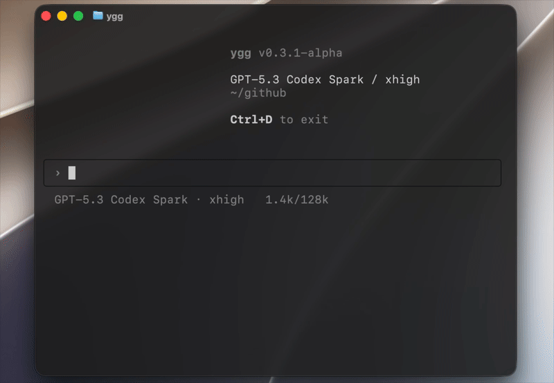
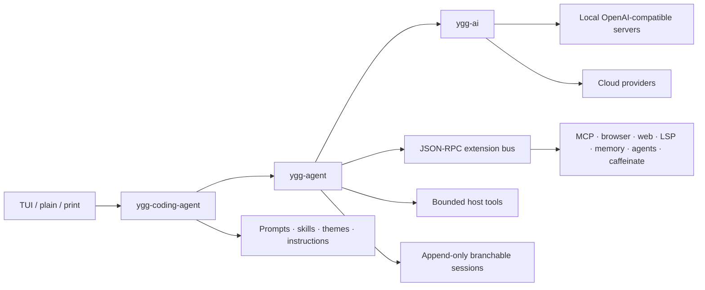

<p align="center">
  <a href="https://skaft.org/ygg">
    
  </a>
</p>

<h1 align="center">ygg</h1>

<p align="center">
  <strong>A tiny and fast coding agent written fully in Rust.</strong>
</p>

<p align="center">
  <a href="https://github.com/skaft-software/ygg/releases/tag/v0.5.0"></a>
  
  
  <a href="LICENSE"></a>
</p>

<p align="center">
  <a href="https://skaft.org/ygg"><strong>Website</strong></a> ·
  <a href="https://skaft.org/ygg/#install"><strong>Install</strong></a> ·
  <a href="https://skaft.org/ygg/docs"><strong>Documentation</strong></a> ·
  <a href="SECURITY.md"><strong>Security</strong></a>
</p>

<p align="center">
  <a href="https://skaft.org/ygg">
    
  </a>
</p>

---

ygg is a local-first coding agent written in Rust. It combines a provider-independent inference layer, durable branchable sessions, explicit tools, image and audio input, configurable compaction, model-advertised Ultra reasoning with bounded task delegation, and a customizable terminal interface.

It supports local OpenAI-compatible servers alongside OpenAI, Anthropic, OpenRouter, and other hosted providers. There is no hosted ygg control plane: model traffic goes directly from your machine to the endpoint you select, and sessions remain local, inspectable JSONL.

> **Apple Foundation Models:** On macOS 27, run `fm serve` from Terminal.app, then configure its OpenAI-compatible endpoint as a custom provider. See the [ygg documentation](https://skaft.org/ygg/docs/) for the current setup.

## Why ygg

Local endpoints are a primary path rather than a compatibility mode. Ygg keeps provider capabilities explicit, regression-tests its default base prompt, loads project context only from trusted workspaces, lets users remove tool authority, and stores sessions on disk.

| Principle | What it means in ygg |
| --- | --- |
| **Local models first** | First-class custom endpoints, offline startup, cold-start-aware timeouts, model discovery, endpoint-reported reasoning controls, and token metrics. |
| **One conversation model** | OpenAI Chat Completions, OpenAI Responses, and Anthropic Messages share typed request, message, tool, usage, and streaming models. |
| **Durable by construction** | Sessions are append-only, parent-linked, branchable, locked, synced, repairable, and inspectable without ygg running. |
| **Authority is explicit** | Workspace trust, tool allowlists, mutation controls, command controls, bounded I/O, and extension trust are visible user decisions. |
| **The terminal handles presentation** | Native scrollback and selection by default, opt-in semantic scrolling, semantic rendering, eleven bundled themes, narrow layouts, and plain-output fallbacks share one terminal model. |
| **Customization is local data** | Prompts, skills, themes, instructions, and extensions are ordinary files with deterministic precedence and reloadable snapshots. |

## Install

ygg currently supports macOS and Linux and requires
[ripgrep](https://github.com/BurntSushi/ripgrep). Prebuilt `v0.5.0`
binaries are available for GNU/Linux x86-64, macOS x86-64, and macOS Apple
silicon. Linux musl is not supported by this release.

### Installer

The version-pinned installer detects the current operating system and
architecture, verifies the matching release archive, and installs `ygg` and
`ygg-host` under `~/.local/bin`:

```sh
curl --proto '=https' --tlsv1.2 -LsSf \
  https://github.com/skaft-software/ygg/releases/download/v0.5.0/install-ygg.sh | sh
```

No Rust toolchain is needed for the default installation. Restart the shell,
then verify the installation:

```sh
ygg --version
ygg --help
```

To compile the pinned tag instead, install
[Rust 1.86 or newer](https://rustup.rs/) and run:

```sh
curl --proto '=https' --tlsv1.2 -LsSf \
  https://github.com/skaft-software/ygg/releases/download/v0.5.0/install-ygg.sh \
  | sh -s -- --from-source
```

### Cargo

To install from source without changing a shell startup file:

```sh
cargo install --locked \
  --git https://github.com/skaft-software/ygg \
  --tag v0.5.0 \
  --bins \
  ygg-coding-agent
```

Ensure Cargo's binary directory is on `PATH`:

```sh
export PATH="${CARGO_HOME:-$HOME/.cargo}/bin:$PATH"
```

### From a checkout

```sh
git clone https://github.com/skaft-software/ygg.git
cd ygg
cargo install --locked --path crates/ygg-coding-agent --bins
```

### Updating

Releases through v0.4.0 do not include `ygg update`. Upgrade those installations
by re-running the v0.5.0 installer above with the same `YGG_INSTALL_DIR`, or by
re-running the pinned Cargo command when Ygg was installed through Cargo. The
installer replaces `ygg`, `ygg-host`, and packaged documentation without
removing `~/.ygg` configuration, credentials, or sessions.

Starting with v0.5.0, Ygg updates through the channel that installed it and
never replaces itself in process: the installer or Cargo swaps the installed
files, and you restart Ygg to pick up the new version.

- Installer: `ygg update` re-runs the version-pinned installer for the
  latest release, so it verifies the release the same way a fresh install
  does.
- Cargo: `ygg update` reinstalls the latest tagged release from the
  repository with a locked, tag-pinned `cargo install`.

```sh
ygg update --check   # report the latest release and the command that would run
ygg update           # run the update for the detected install method
```

In the TUI, `/update` checks for a newer release and tells you to run
`ygg update`. Extension packages are not updated by `ygg update`; after updating
Ygg, run `ygg extension update <name>` for each installed official package so
its exact compatibility matches the new release.

### Executable extension bundles

The optional first-party executable extensions are separate, inert packages.
For example:

```sh
ygg extension install ygg-web-search
ygg extension list
```

Published bundles are checksum-verified and installed atomically under
`~/.ygg/extensions/<id>`. Installation does **not** enable, trust, or start the
process. Explicitly opt in when launching Ygg:

```sh
ygg --enable-extension ygg-web-search --trust-extension ygg-web-search
```

The small release catalog contains `ygg-browse`, `ygg-hermes-memory`, `ygg-mcp`,
`ygg-ssh`, `ygg-subagents`, and `ygg-web-search`. Use
`ygg extension update <name>` or `ygg extension remove <name>` to manage one.
Offline and third-party archives can be installed with
`ygg extension install --path ./bundle.tar.gz`. Replace one atomically with
`ygg extension update --path ./new-bundle.tar.gz`. Ygg runs no
install hook or dependency provisioner. Packaged skills are discovered but
still require explicit activation. See the
[executable-extension documentation](docs/extensions.md) for setup, trust, and
local-install details.

### Graphical Serve extension

The optional first-party Serve package provides a loopback-only web interface.
It is version-matched to Ygg and installed separately from the terminal binary:

```sh
ygg extension install ygg-serve
ygg serve
```

For a headless launch on an operating-system-selected port:

```sh
ygg serve --no-open --port 0
```

Use `ygg extension list` to inspect packages. Run `ygg extension update ygg-serve`
or `ygg extension remove ygg-serve` to manage Serve. A downloaded release
archive can be installed with `ygg extension install --path ARCHIVE` or updated
atomically with `ygg extension update --path ARCHIVE`.
Removing the package leaves sessions and other Serve data intact.

### Container

The included linux/amd64 image builds Ygg from a clean, tracked Git snapshot,
uses digest-pinned base images and Debian package snapshots, runs as an
unprivileged user, and expects an explicit workspace mount. The build script
refuses tracked changes and excludes all untracked workstation content:

```sh
scripts/build-ygg-image.sh ygg:0.5.0
docker run --rm -it \
  -e ANTHROPIC_API_KEY \
  -v "$PWD:/workspace" \
  ygg:0.5.0 --model claude-sonnet-4-6
```

Only pass credentials and mount paths the container actually needs. The image
keeps its read-only packaged documentation under `/usr/local/share/ygg`, exposed
to Ygg through `YGG_PACKAGE_DIR`.

## Quick start

### Use a cloud model

Set the provider credential, then select a model. ygg discovers the live model catalog where the provider exposes one.

```sh
export ANTHROPIC_API_KEY='...'
ygg --model claude-sonnet-4-6
```

```sh
export OPENAI_API_KEY='...'
ygg --model gpt-5.4
```

```sh
export OPENROUTER_API_KEY='...'
ygg --model openrouter/anthropic/claude-sonnet-4.6
```

ChatGPT subscription users can use the hosted device flow instead of manually managing an API key:

```sh
ygg --login codex
ygg --model gpt-5.6
```

When that account's live Codex catalog advertises both the `ultra` effort and
V2 collaboration for the selected model, Ultra enables maximum reasoning plus
automatic bounded task delegation:

```sh
ygg --model gpt-5.6-sol --reasoning ultra
```

Ygg does not infer Ultra, collaboration, or the Responses Lite transport from a
model name or subscription plan. Account-scoped cached live metadata is honored;
a missing or unusable cache falls back conservatively without those capabilities.

### Use custom OpenAI-compatible providers

Configure all custom endpoints together in `~/.ygg/credentials/custom.json`:

```json
{
  "version": 1,
  "providers": {
    "apple-fm": {
      "label": "Apple Foundation Models",
      "base_url": "http://127.0.0.1:1976/v1/",
      "auth": { "kind": "none" },
      "auto_discover": true,
      "startup_timeout_secs": 300,
      "models": [
        {
          "api_name": "system",
          "context_window": 8192,
          "max_output_tokens": 1024,
          "tools": true,
          "parallel_tool_calls": false,
          "vision": false,
          "structured_output": false,
          "reasoning": true,
          "reasoning_configurable": false
        }
      ]
    },
    "home-server": {
      "label": "Home Server",
      "base_url": "http://192.168.1.20:8000/v1/",
      "auth": { "kind": "bearer_env", "var": "HOME_SERVER_API_KEY" },
      "auto_discover": true
    }
  }
}
```

Apple Foundation Models advertises sparse model metadata, so keep the explicit
`system` entry at its documented 8192-token context window. Its on-device model
thinks by default and exposes `on` as the only ygg thinking option; it does not
support a configurable `reasoning_effort`, so keep `reasoning` enabled and
`reasoning_configurable` disabled. The `pcc` model has a separate 32768-token
context window and supports low/medium/high reasoning effort. Configured model
metadata overrides matching discovery results.

Each provider is independently discovered and selectable. Models use stable,
provider-qualified IDs such as `custom/apple-fm/<model-id>`, and the configured
labels appear in the picker and `/status`. API keys should be referenced through
environment variables rather than written to this file.

Existing single-object `custom.json` files are still accepted and normalized to
the legacy `custom-openai` provider in memory, so their existing model IDs keep
working. New configurations should use the registry shape above.

If an endpoint cannot provide a useful `GET /v1/models`, set
`auto_discover` to `false` and configure its inventory under that provider:

```json
{
  "version": 1,
  "providers": {
    "local": {
      "label": "Local Qwen",
      "base_url": "http://127.0.0.1:8000/v1/",
      "auth": { "kind": "none" },
      "auto_discover": false,
      "models": [
        {
          "api_name": "Qwen/Qwen3-Coder-Next",
          "display_name": "Qwen3 Coder Next",
          "context_window": 131072,
          "max_output_tokens": 16384,
          "tools": true,
          "parallel_tool_calls": false,
          "vision": false,
          "structured_output": false,
          "reasoning": true,
          "reasoning_values": ["none", "default"],
          "reasoning_default": "default"
        }
      ]
    }
  }
}
```

Protect the credential file with `chmod 600`. Use `--offline` to skip optional
model discovery during startup; inference still reaches the selected endpoint.

## What ships in the binary

### Three frontends

| Mode | Command | Best for |
| --- | --- | --- |
| Interactive TUI | `ygg` | Daily work: streaming, tools, themes, pickers, branching, steering, and native scrollback. |
| Chronological plain mode | `ygg --plain` | Basic terminals, logs, accessibility tooling, and environments where cursor control is undesirable. |
| Response-only print mode | `ygg -p "prompt"` | Shell composition and scripts that want the final response on stdout. |

All three frontends use the same agent loop, provider layer, session format, safety policy, and cancellation behavior.

The interactive TUI startup card reports `permissions:` followed by **full access**
by default, with the access value shown in bold red. Launching with
`--safe-mode` changes the value to **safe mode**, shown in bold accent color
(blue in the default theme), and enables approval gates for each bash call and workspace mutation.

### Built-in tools

| Tool | Purpose | Registered by default |
| --- | --- | --- |
| `read` | Bounded text reads with line-oriented output. | On |
| `edit` | Exact, stale-aware replacements within the workspace policy. | On |
| `write` | Create or replace complete files within the workspace policy. | On |
| `bash` | Run commands through a Bash-compatible shell with bounded output, timeout, cancellation, and process-group cleanup. | On |
| `search` | Ripgrep-backed workspace search. | Opt-in |

The model-visible schema and executable registry are built from the same final
allowlist. A disabled tool cannot remain advertised to the model. Registration
does not itself authorize an effect: the default policy (`UnsafeHost`) gives
authoritatively classified effects the Ygg process's ambient host authority, subject
to the existing tool and sandbox gates. `--safe-mode` selects
`ControlledBashApproval`, requiring workspace-mutation approval and one-shot approval
for every `bash` process call while denying other ambient host effects. Unknown
effects always fail closed.

`--safe-mode` requires confirmation for every `bash` host process call and keeps
workspace reads/mutations controlled. Without it, an enabled, trusted executable
extension may start and classified effects use the current user's authority. Safe
mode also forces `allow_external_paths = false`, regardless of the broad path
default, so file admission and execution remain workspace-relative. Full-access mode
is intended only inside a separately isolated account, container, VM, or platform
sandbox. `--safe-mode` is canonical; `--safe` remains a hidden compatibility alias.
The former `--yolo` flag and its configuration/environment forms are no longer
accepted.

```sh
# Read-only review
ygg --tools read,search --no-context-files --offline

# No file mutation
ygg --no-edit

# No command execution
ygg --no-process

# No tools at all
ygg --no-tools
```

In the default full-access mode, `bash` runs with the authority of the
current operating-system user. Like Pi, it passes every complete command to one
selected shell with `-c`; on Unix Ygg uses an explicit `shell_path` first, then
`/bin/bash`, `bash` on `PATH`, and finally `sh`. It does not consult `$SHELL`.
`--no-process` and `--no-shell` remain equivalent authority gates. Use
`--safe-mode` to require approval for each action.
For untrusted repositories, use a container, VM, or restricted account; see
[SECURITY.md](SECURITY.md).

### Provider and protocol support

| Protocol | Streaming | Tools | Reasoning | Images | Structured output |
| --- | :---: | :---: | :---: | :---: | :---: |
| OpenAI Responses | ✓ | ✓ | ✓ | ✓ | ✓ |
| OpenAI Chat Completions | ✓ | ✓ | ✓ | ✓ | ✓ |
| Anthropic Messages | ✓ | ✓ | ✓ | ✓ | ✓ |

Built-in provider presets include OpenAI, Anthropic, OpenRouter, DeepSeek, Groq, Cerebras, xAI, Together AI, Fireworks AI, NVIDIA, Hugging Face, Moonshot AI, Xiaomi, MiniMax, and OpenCode Zen. Custom OpenAI-compatible endpoints cover local servers such as llama.cpp, vLLM, SGLang, LM Studio, and compatible gateways.

Capability handling is model-specific. ygg validates modalities, tool use, structured output, output limits, and reasoning before sending a request. When a custom endpoint reports an exact reasoning control—off-only, binary on/off, or named levels—the picker and request wire values follow that metadata exactly.

Codex routes that advertise Responses Lite use that transport contract for both
ordinary and native compact requests. Ygg sends the Lite header, places tool
schemas and developer instructions in input items, explicitly disables parallel
tool calls, requests reasoning context across all turns, and removes only
unsupported image-detail hints. This behavior is capability-driven rather than
coupled to an endpoint name or OAuth plan.

### Reasoning without transcript noise

Reasoning is collapsed by default while remaining available with `Ctrl+O`. During generation, a fixed two-row status uses a blinking, model-colored event-margin dot beside a plain-weight label, with an aligned disclosure elbow below. It shows only the latest explicit Markdown heading emitted by the model—an ATX heading or standalone bold-heading paragraph—and falls back to `Thinking`; ordinary reasoning body text is never promoted into the collapsed label. Expanded reasoning keeps the same inset without an event-margin dot or a synthetic first-line bullet. Completed reasoning disappears again when collapsed.

```text
• Verifying the implementation
  └ (ctrl+o to expand)
```

Event-margin dots identify active collapsed reasoning, assistant responses, and tool or shell execution. The collapsed-reasoning dot blinks; other active dots pulse through foreground and muted tones without changing glyph size. Successful completed events use green, and failed tools use red.

Select a supported level at launch or while the session is running:

```sh
ygg --reasoning high
```

```text
/thinking off
/thinking on
/thinking minimal
/thinking low
/thinking medium
/thinking high
/thinking xhigh
/thinking max
/thinking ultra
```

The available choices are narrowed to the selected model. `ultra` appears only
when the model advertises Ultra effort and a V2 collaboration protocol that this
Ygg build can execute. Selecting it installs six collaboration tools
(`spawn_agent`, `followup_task`, `send_message`, `wait_agent`, `list_agents`, and
`interrupt_agent`) and tells the root agent to delegate when parallel work would
materially improve speed or quality. Safe mode does not grant `delegation`;
executing those tools requires the default full-access policy.

One Ultra team defaults to four concurrent agents including the root, depth two,
and sixteen total agents during each owning run. Children use isolated durable
sessions and inherit the root's effective current prompt, approved tools,
sandbox, model, reasoning, compaction, completion, output, resolved output-token,
retry, turn, and cost policies. Accepted tasks, direct messages, and follow-ups
are rejected on overflow instead of being truncated or evicted; interruption and
run failure preserve unacknowledged work in FIFO order. Bounded `wait_agent`
pages stay leased until their complete tool result is durably recorded, then use
UTF-8-safe continuation pages as needed. Children and their descendants are
cancelled when the owning run stops. Team state lives under the session
directory's private `.delegation/team-*` tree with a synced
`provenance.jsonl`; persistence failure stops the team rather than continuing
without an audit trail, and failed activation securely removes its empty private
team directory.

Token-budget reasoning is also available for compatible models with
`--reasoning budget=N`.

### Multimodal prompts

Paste or mention a supported image in the composer. Attachments are represented as explicit chips, remain ordered with text, and are accepted only when the selected model advertises the required input modality. Unsupported media stays visible as a path plus a diagnostic rather than being silently discarded.

### Durable branchable sessions

ygg sessions are bounded append-only JSONL, namespaced by workspace. Complete semantic boundaries are persisted; provisional streaming deltas are not. Each entry points to its parent, which makes checkout and branching cheap without rewriting history.

```sh
ygg --continue
ygg --resume
ygg --resume SESSION_ID

ygg sessions list
ygg sessions list --query parser
ygg sessions inspect SESSION_ID
ygg sessions rename SESSION_ID "parser hardening"
ygg sessions tag SESSION_ID rust local-model
ygg sessions export SESSION_ID --output ./handoff.ygg-session.json
ygg sessions delete SESSION_ID
ygg sessions repair SESSION_ID
```

- Session listing is read-only and uses lightweight bounded metadata scans.
- Deletion moves data into a recoverable trash directory.
- Repair only removes an interrupted final append and writes a private backup first.
- Export validates the session and redacts credential-like values by default.
- A dropped run never silently replays an unresolved mutating tool call.
- Resume restores the selected model, reasoning, prompt identity, tool panels, branches, and historical prompt colors.

See [docs/sessions.md](docs/sessions.md) for the record schema, branch semantics, redaction contract, and recovery behavior.

### Context and compaction

ygg estimates the next provider-visible request against the active model's context window. Local compaction creates a bounded summary at a safe completed-turn boundary, preserves an approximately token-bounded recent tail, and keeps active skill state. OpenAI Responses routes can instead use provider-native opaque compaction without exposing that payload in the transcript.

```toml
[compaction]
mode = "local" # disabled, local, or native-responses
threshold_fraction = 0.85
keep_recent_tokens = 20000
compact_model = "openrouter/anthropic/claude-haiku-4.5"
```

`native-responses` requires the active OpenAI Responses endpoint and model; it never falls back to a Chat or Anthropic summary. The legacy `enabled = true` and `YGG_AUTO_COMPACT=true` spellings continue to select `local`. Run `/compact` at any time to request a manual compaction. The compact footer uses the latest provider turn's authoritative usage rather than cumulative traffic.

## Terminal experience

ygg's TUI is built on a vendored, terminal-correct Rust renderer. It treats native terminal behavior as a feature, not an implementation detail.

- Native scrollback and drag selection are the default (`mouse = "auto"`); Ygg leaves mouse reporting disabled and lets committed transcript rows flow into terminal history.
- The default renderer follows logical content height instead of pinning the composer and footer inside a fixed full-screen viewport. Ordinary frames reuse the retained stable prefix and render only the mutable/new suffix.
- Slash/path completions, panels, reports, and other temporary chrome repaint a bounded screen surface without entering native history. If streamed Markdown contracts across the committed seam, the renderer holds that ledger until it can reconcile stable rows exactly once.
- A terminal resize reflows the retained semantic transcript at the new width, resets terminal saved lines, and replays Ygg's retained transcript once.
- `--mouse app` explicitly captures the mouse and uses a bounded semantic viewport. In that mode, scrolling above the tail stays anchored while streamed Markdown grows, reports new output, and lets PageDown return to live output.
- Stable-prefix differential rendering, synchronized atomic frames, and bounded repaint regions.
- Responsive wide and narrow layouts with Unicode, ASCII, truecolor, 256-color, 16-color, and no-color fallbacks.
- Semantic tool intent/lifecycle states, rich Markdown, syntax highlighting, tables, task lists, and links, with bounded sanitized tool-output projections.
- Prompt colors tied to model labs in the default theme; named themes retain their own authored palettes.
- Exact theme replacement: switching back to default does not retain attributes from the previous theme.
- Eleven bundled themes: `bone-machine`, `circuit-garden`, `field-notes`, `kawaii-pink`, `oxide-console`, `paper-ledger`, `signal-noir`, `synthwave-relay`, `tidepool`, `violet-hour`, and `zen-mono`.
- Terminal control-sequence sanitization in user- and provider-controlled text.
- The `sexy-tui-rs` crate enforces its memory-safety boundary with `#![forbid(unsafe_code)]`.

Default `auto`, explicit `terminal`, and `off` modes all leave mouse events to the terminal and use the native-scrollback renderer. Application-owned `app` mode captures mouse events for semantic scrolling and selection. Portable terminal protocols do not expose the native history's reading offset, so only `app` mode can guarantee an anchored read-while-streaming viewport. Keyboard transcript navigation remains available in every mode.

Raw protocol arguments and envelopes, unsanitized failure payloads, and
extension-rendered tool payloads remain internal accountability evidence and are
excluded from transcript copy. Ctrl+O expands retained reasoning, compaction,
bounded search/shell output, and edit/write diffs; it cannot recover bytes the
tool capture already discarded. Failed runs retain `failed · <duration>` and
show a bounded, terminal-safe reason. Provider diagnostics are request-credential
redacted before reaching the frontend. Final structured tool results are retained
and sent to the provider only when required to continue the tool protocol; live
progress is neither persisted nor sent to the model.

```sh
ygg --theme kawaii-pink
ygg --color auto
ygg --mouse app
```

Custom themes are local TOML files and can control semantic roles, glyphs, density, responsive breakpoints, transcript surfaces, and terminal capability fallbacks. See [docs/themes.md](docs/themes.md).

## sexy-tui-rs themability

The vendored [`sexy-tui-rs`](crates/sexy-tui-rs) renderer is themeable by design. These recordings show the same terminal experience across four different visual treatments:

<table>
  <tr>
    <td width="50%"></td>
    <td width="50%"></td>
  </tr>
  <tr>
    <td width="50%"></td>
    <td width="50%"></td>
  </tr>
</table>

## Interactive command reference

Type `/` in the composer to open live command discovery.

| Command | Purpose |
| --- | --- |
| `/new` | Start a fresh conversation. |
| `/resume [id]` | Open the session picker or resume a session. |
| `/tree` | Show the complete conversation branch tree. |
| `/checkout <id>` | Move the durable head to another entry and branch from it. |
| `/model [id]` | Open the model picker or select a model. |
| `/thinking [level]` | Inspect or change model-supported reasoning. |
| `/compact` | Compact at the next safe boundary. |
| `/theme [name\|list\|reload]` | Select, inspect, or reload themes. |
| `/verbose [on\|off]` | Expand or collapse retained reasoning and bounded tool-output projections. |
| `/reload` | Reload instructions, themes, prompts, skills, and enabled extensions. |
| `/login [provider]` | Sign in to a subscription provider. |
| `/logout [provider]` | Remove its stored credential. |
| `/status` | Show active model, context, capabilities, and diagnostics. |
| `/cost` | Show turn and session usage/cost accounting. |
| `/cache` | Show prompt-cache diagnostics reported by the provider. |
| `/update` | Check for a newer release; run `ygg update` to install. |
| `/name [name]` | Show or rename the current session. |
| `/export [path]` | Export the current session with redaction. |
| `/prompt [name] [arguments]` | List or expand named prompt templates. |
| `/skills ...` | List, search, inspect, load, unload, or reload skills. |
| `/extensions [reload]` | Inspect discovered extensions or replace running UnsafeHost extension processes. |
| `/quit` | Exit ygg. |

Useful keys:

| Key | Action |
| --- | --- |
| `Enter` | Submit. |
| `Shift+Enter` | Insert a newline when the terminal reports enhanced key events. |
| `Ctrl+C` | Clear a nonempty draft; with an empty draft, abort active work and do nothing when idle. |
| `Ctrl+D` | Close ygg from any interactive input surface, settling active work and child-process cleanup first. |
| `Ctrl+O` | Expand or collapse reasoning, tool evidence, or shell output. |
| `PageUp` / `PageDown` | Navigate transcript history. |
| `Tab` | Complete trailing `./`, `../`, `~/`, and absolute path tokens. Directories remain open for continued completion, and spaces are backslash-escaped. |
| `@` | Fuzzy-complete gitignore-aware workspace file mentions; path-prefixed mentions also use filesystem completion. |

## Configuration

Configuration layers are deterministic. Later, more explicit layers win:

1. Built-in defaults.
2. `~/.ygg/config.toml`.
3. Trusted project `.ygg/config.toml` when `--workspace-trusted` is present.
4. Environment variables.
5. CLI flags.
6. Resumed session model/reasoning, unless the CLI explicitly overrides them.

A project configuration may tighten user authority floors but cannot relax them.

Example `~/.ygg/config.toml`:

```toml
model = "custom/Qwen3 Coder Next"
reasoning = "high"
system_prompt = "You are a careful and concise reviewer."
cache_retention = "short"
theme = "default"
color = "auto"
# auto/terminal/off: native selection/history; app: semantic viewport
mouse = "auto"
plain = false

# ygg defaults to full host access. Pass --safe-mode to require approval
# for each action. This capability setting independently keeps paths local.
allow_external_paths = false
allow_edit = true
allow_write = true
allow_process = true
allow_shell = true
# Remote HTTPS image/audio reads are default-off network authority.
allow_remote_read = false
bash_timeout_secs = 120
max_output_bytes = 1048576
context_files = true
offline = false

# Optional budget controls, expressed in integer microdollars.
# max_cost_microdollars = 500000
# cost_warning_microdollars = 50000

[compaction]
mode = "local"
threshold_fraction = 0.85
keep_recent_tokens = 20000
# compact_model = "provider/model"
```

Common environment variables mirror those fields: `YGG_MODEL`, `YGG_REASONING`, `YGG_SYSTEM_PROMPT`, `YGG_CACHE_RETENTION`, `YGG_THEME`, `YGG_COLOR`, `YGG_MOUSE`, `YGG_WORKSPACE`, `YGG_SESSION_DIR`, `YGG_MAX_TURNS`, `YGG_COMPACTION_MODE`, `YGG_SHELL_PATH`, `YGG_BASH_TIMEOUT_SECS`, `YGG_MAX_OUTPUT_BYTES`, `YGG_OFFLINE`, and the `YGG_ALLOW_*` capability controls. Remote URL reads specifically require `allow_remote_read = true`, `YGG_ALLOW_REMOTE_READ=true`, or `--allow-remote-read`; `--offline` always disables them. Use `--safe-mode` for approval-only execution. It resolves `allow_external_paths` to false. The previous `YGG_EXEC_TIMEOUT_SECS` name and boolean `YGG_AUTO_COMPACT` remain compatibility fallbacks.

`reasoning_mode = "pro"`, `YGG_REASONING_MODE=pro`, and
`--reasoning-mode pro` are accepted only to load legacy configuration and
sessions. Ygg migrates that selection to `reasoning = "ultra"` only when current
model metadata advertises complete Ultra/V2 support; otherwise it removes the
obsolete mode, keeps the independently selected supported effort, and emits a
warning. New configuration should use `reasoning` alone.

### CLI reference

| Area | Options |
| --- | --- |
| Provider auth | `--login`, `--logout`, `--headless` |
| Frontend | `--print`, `--plain`, `--color`, `--mouse`, `--show-reasoning` |
| Session | `--continue`, `--resume`, `--session-dir`, `sessions ...` |
| Model | `--model`, `--reasoning`, `--cache-retention`, `--max-turns` |
| Workspace | `--workspace`, `--workspace-trusted`, `--no-context-files`, `--offline` |
| Tools | `--tools`, `--exclude-tools`, `--no-tools`, `--no-edit`, `--no-write`, `--no-process`, `--no-shell`, `--allow-shell`, `--safe-mode`, `--shell-path` |
| Limits | `--bash-timeout-secs`, `--max-output-bytes` |
| Customization | `--theme`, `--theme-dir`, `--system-prompt`, `--prompt`, `--debug-prompt`, `--prompt-template`, `--skill-dir`, `--extension-dir`, `--enable-extension`, `--trust-extension` |

Run `ygg --help` and `ygg sessions --help` for the authoritative generated reference.

## Filesystem-native customization

Themes, prompts, skills, and extensions use one deterministic resolver:

| Kind | Global | Trusted project | Explicit source |
| --- | --- | --- | --- |
| Themes | `~/.ygg/themes/*.toml` | `.ygg/themes/*.toml` | `--theme-dir` |
| Prompts | `~/.ygg/prompts/*.{md,toml}` | `.ygg/prompts/*.{md,toml}` | `--prompt-template` |
| Skills | `~/.ygg/skills/*/SKILL.md` | `.ygg/skills/*/SKILL.md` | `--skill-dir` |
| Extensions | `~/.ygg/extensions/*/extension.toml` | `.ygg/extensions/*/extension.toml` | `--extension-dir` |

Roots are resolved global → trusted project → explicit. Inputs must be bounded regular files; symlinked roots, candidates, and entrypoints are rejected. Reload builds a complete immutable generation before swapping it into the running product.

### Prompt templates

Markdown and TOML prompt templates can accept arguments and include bounded files. Selection name and content hash are persisted as session provenance. `--debug-prompt` exposes the exact final expansion before it reaches the provider. 

You can also replace the entire composed system instructions via `system_prompt` (config), `YGG_SYSTEM_PROMPT`, or `--system-prompt`; AGENTS/context/skills are ignored when it is set. Passing `--system-prompt` with no argument sets an explicit empty prompt.

### Skills

Skills are explicit, inspectable capability packages. ygg discovers metadata, activates only selected skills, injects active instructions once, and loads referenced resources lazily through bounded reads. Activation and resource reads are durable session events.

### Executable extensions

Ygg is a small agent kernel and JSON-RPC bus. MCP bridges, browsers, web search,
computer use, memory, LSP, subagent orchestration, and caffeinate belong in
replaceable subprocess extensions; the host owns the model loop, bounded
transport, sessions, permissions, process cleanup, and generic host services
that extensions need in order to run.

Extensions speak bounded line-delimited JSON-RPC. API `0.2` supports live tool
registration/removal, frozen per-model-request catalog snapshots, optional
host-owned child-agent sessions, durable session/process ownership, artifact
publication, policy intents with optional single-use approvals,
manifest-allowlisted owner-scoped secret lookup, and crash restart with bounded
backoff after a successful handshake. The coding product currently leaves
approval issuance and secret brokerage unconfigured, so policy requests remain
default-deny and `secrets` is not offered. Replacement processes must initialize
successfully before cutover. Python extensions can use the dependency-free
[`ygg-extension-sdk`](sdk/python/README.md) instead of reimplementing the
protocol loop.

Discovery does not execute code. An extension must be enabled and its exact
source independently trusted; the default full-access policy permits startup,
while `--safe-mode` reports discovered extensions but never starts their
processes, even when the process/shell gates are enabled. A project configuration
cannot grant trust to itself. Admitted extensions run with the launching user's
OS authority. Initial handshake failures and hung-but-open processes are
not yet supervised, and a full application rebuild currently recreates extension
processes.

Start with [examples/README.md](examples/README.md), then read [docs/resources.md](docs/resources.md) and [docs/extensions.md](docs/extensions.md).

### Self-documentation

Ygg releases ship `README.md`, `docs/`, `examples/`, and `sdk/` beside the
binary's package assets. The default system prompt points the model to their
absolute paths and tells it to read them when answering Ygg questions or making
Ygg changes. The shell installer places those assets under the matching
`share/ygg/` data directory; `YGG_PACKAGE_DIR` or `YGG_DATA_DIR` can override
that asset root for other layouts.

When Ygg runs from its source checkout, the system prompt instead points to
that checkout's `README.md`, `docs/`, `examples/`, `sdk/`, `crates/`, and
`ygg-coding-agent` crate so it can inspect and extend the implementation. From
an installation without local package assets, `/help` points to the published
documentation at https://skaft.org/ygg/docs.

## Architecture


```mermaid
flowchart LR
    UI["TUI / plain / print"] --> Product["ygg-coding-agent"]
    Product --> Agent["ygg-agent"]
    Agent --> AI["ygg-ai"]
    AI --> Local["Local OpenAI-compatible servers"]
    AI --> Cloud["Cloud providers"]
    Agent --> Bus["JSON-RPC extension bus"]
    Bus --> Extensions["MCP · browser · web · LSP · memory · agents · caffeinate"]
    Agent --> Tools["Bounded host tools"]
    Agent --> Sessions["Append-only branchable sessions"]
    Product --> Resources["Prompts · skills · themes · instructions"]
```

### `ygg-ai`

The provider-independent inference crate owns canonical messages, media, tools, reasoning state and effort, structured output, request validation, cross-protocol conversion, authentication, exact integer pricing, SSE parsing, streaming completion assembly, and capability-driven Responses Lite encoding. Collaboration metadata remains a model capability here; host orchestration does not.

### `ygg-agent`

The agent runtime is the kernel: it owns sessions, model conversations, context
reconstruction, compaction, tool execution, steering, cancellation, retries,
checkpoints, usage records, cache accounting, the frontend event stream,
extension transport/supervision, and bounded child-session services. The
current native V2 delegation runtime is a transitional consumer of those child
sessions; domain-specific orchestration belongs behind the extension boundary.

### `ygg-coding-agent`

The product crate owns configuration, provider discovery, credentials, prompts, resources, extensions, session commands, hydration, terminal presentation, themes, and the three user-facing modes. It decides whether live metadata and the available host runtime form complete Ultra semantics and enables proactive V2 delegation only for that selection.

### `sexy-tui-rs`

The vendored terminal renderer supplies editing, key handling, fuzzy completion, rich Markdown, syntax highlighting, semantic diffs, terminal image handling, capability degradation, responsive widgets, and differential live rendering.

Detailed contracts live in [docs/design/ygg-ai.md](docs/design/ygg-ai.md), [docs/design/ygg-agent.md](docs/design/ygg-agent.md), [docs/design/ygg-coding-agent.md](docs/design/ygg-coding-agent.md), and [docs/design/ygg-tui.md](docs/design/ygg-tui.md).

## Reliability and security engineering

ygg is intentionally honest about where its boundary ends.

- **Workspace paths:** descriptor-relative, no-follow file operations prevent parent-symlink replacement from redirecting built-in reads and mutations.
- **Bounded inputs:** provider streams, discovery payloads, configuration, credentials, context, sessions, tool arguments/results, and local reads have byte/count limits.
- **Crash behavior:** complete records survive; a torn final append is narrowly repairable; unresolved mutation is reported as indeterminate and never replayed.
- **Cancellation:** provider streams, retry waits, compaction, tools, delegated agents, and descendant process/agent groups observe cancellation.
- **Delegation provenance:** Ultra team directories and files are owner-private and created through descriptor-relative, no-follow operations. Spawns, messages, follow-ups, status changes, and interrupts are synced before becoming visible; a journal failure cancels the team and rejects further work.
- **Network recovery:** non-timeout connection-establishment failures and response-body disconnects retry up to five times with visible diagnostics; provisional TUI output is discarded before replacement. Full transport timeouts are terminal. Failures while sending a POST or awaiting response headers are also terminal because provider acceptance is ambiguous.
- **Secret handling:** credential files are owner-private, sensitive headers are marked, redirects are disabled, provider diagnostics redact request credentials, debug formatting redacts secrets, and session export applies bounded deterministic redaction.
- **Terminal safety:** untrusted terminal controls are neutralized; terminal capabilities degrade without changing semantic content.
- **Dependency policy:** `cargo audit` and `cargo deny` cover advisories, licenses, bans, duplicate visibility, and source policy as release gates.
- **Verification:** protocol fixtures, adversarial streaming tests, filesystem race tests, VT100 rendering, PTY shutdown tests, and full workspace tests cover the release invariants.

These controls do not contain a command the user has chosen to enable. Run ygg inside an OS isolation boundary when the repository, model, or extension is untrusted. Read the full [security policy](SECURITY.md) before using autonomous tools on sensitive machines.

## Development

Normal builds are deterministic and use checked-in model metadata.

```sh
cargo fmt --all -- --check
cargo check --workspace --all-targets --all-features --locked
cargo test --workspace --all-targets --all-features --locked
cargo test --workspace --doc --locked
cargo clippy --workspace --all-targets --all-features --locked -- -D warnings
cargo audit
cargo deny check
```

Build the release binary:

```sh
cargo build --release --locked -p ygg-coding-agent --bin ygg
```

The declared MSRV is Rust 1.86. Command execution is Unix-only. See [CONTRIBUTING.md](CONTRIBUTING.md) for contribution scope, review expectations, and the release checklist.

## Repository map

```text
crates/ygg-ai/            provider-independent inference and protocols
crates/ygg-agent/         agent runtime, tools, sessions, and extensions
crates/ygg-coding-agent/  CLI, provider discovery, resources, and TUI
crates/sexy-tui-rs/       vendored terminal rendering library
sdk/python/              dependency-free Python extension SDK
docs/                     public product and architecture contracts
examples/                 prompts, skills, themes, and extensions
fuzz/                     session-record fuzz target
deploy/                   non-root container build
scripts/                  pinned installer
third_party/              upstream license texts
```

## Documentation

| Document | Covers |
| --- | --- |
| [Security policy](SECURITY.md) | Authority boundary, containment, threat model, and private reporting. |
| [Changelog](CHANGELOG.md) | Release-level behavior and compatibility changes. |
| [Release notes](docs/releases/v0.5.0.md) | Current installation, highlights, compatibility notes, and limitations. |
| [Resources](docs/resources.md) | Discovery, precedence, trust, bounds, diagnostics, and reload. |
| [Extensions](docs/extensions.md) | Manifest, JSON-RPC protocol, contributions, lifecycle, and trust. |
| [Python extension SDK](sdk/python/README.md) | Decorators, stdio framing, handshake, logging, and host requests. |
| [Native SDK host](docs/sdk.md) | Versioned NDJSON application protocol, sessions, providers, safety, and cancellation. |
| [Themes](docs/themes.md) | Theme schema, roles, glyphs, responsive layout, and fallback behavior. |
| [Sessions](docs/sessions.md) | Commands, JSONL schema, branching, export, redaction, and repair. |
| [AI architecture](docs/design/ygg-ai.md) | Canonical inference model, validation, transport, and streaming. |
| [Agent architecture](docs/design/ygg-agent.md) | Run loop, persistence, tools, cancellation, and compaction. |
| [Product contract](docs/design/ygg-coding-agent.md) | Bootstrap, modes, configuration, resources, and UX. |
| [TUI architecture](docs/design/ygg-tui.md) | Rendering, terminal capability handling, scrolling, and themes. |
| [Examples](examples/README.md) | Ready-to-adapt prompts, skills, and executable extensions. |

## Built by Achu

Ygg is an independent project I use for daily repository work. It is still early: configuration, session, and extension interfaces may change, and an enabled command tool runs with the authority of the user who launched it. Use an isolated account, container, or VM for untrusted repositories or model endpoints; the full boundary is documented in [SECURITY.md](SECURITY.md).

I am a software engineer in Toronto building developer tools, local inference systems, and audio software. If you work in those areas and want to compare notes, feel free to reach out.

- [GitHub — @achuthanmukundan00](https://github.com/achuthanmukundan00)
- [Personal site — achumukundan.dev](https://achumukundan.dev)
- [Skaft — local-first developer tools](https://skaft.org)

## License and acknowledgements

ygg is distributed under the [MIT License](LICENSE).

ygg uses architectural concepts and terminal interaction patterns from [Pi](https://github.com/earendil-works/pi). Its development and evaluation were also informed by [Terminal-Bench](https://github.com/harbor-framework/terminal-bench). Copyright, provenance, and upstream license texts are preserved in [THIRD_PARTY_NOTICES.md](THIRD_PARTY_NOTICES.md) and [`third_party/licenses/`](third_party/licenses/).

---

<p align="center">
  <a href="https://skaft.org/ygg"><strong>skaft.org/ygg</strong></a><br>
  <sub>Local models first. Explicit control. Open source.</sub>
</p>
