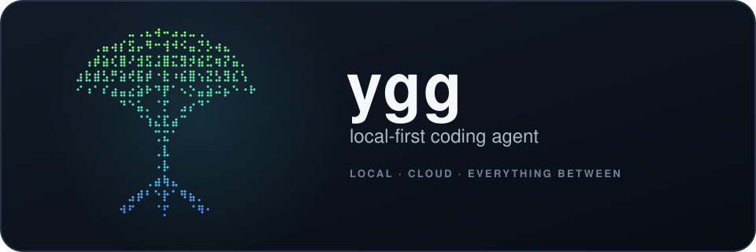
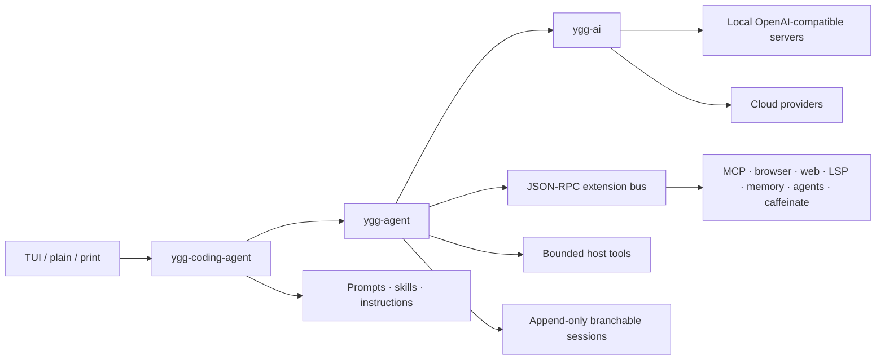

<p align="center">
  <a href="https://skaft.org/ygg">
    
  </a>
</p>

<h1 align="center">ygg</h1>

<p align="center">
  <strong>A high-performance coding agent for real work.</strong><br>
  Fast, context-efficient, and deeply integrated.
</p>

<p align="center">
  <a href="https://github.com/skaft-software/ygg/releases/tag/v0.6.7"></a>
  
  
  <a href="LICENSE"></a>
</p>

<p align="center">
  <a href="#install"><strong>Install</strong></a> ·
  <a href="docs/benchmarks/tb21-v0.6.2/README.md"><strong>Performance</strong></a> ·
  <a href="ROADMAP.md"><strong>Roadmap</strong></a> ·
  <a href="https://skaft.org/ygg/docs"><strong>Documentation</strong></a> ·
  <a href="SECURITY.md"><strong>Security</strong></a>
</p>

ygg is a high-performance coding agent written in Rust. It works with frontier
cloud models and local OpenAI-compatible servers, keeps durable inspectable
sessions on disk, and puts optional capabilities behind language-neutral
extension boundaries. Native speed, context efficiency, local-model support,
and deep integrations serve one goal: getting real work to a useful,
reviewable result with less overhead.

## Install

ygg supports macOS and GNU/Linux x86-64 and requires
[ripgrep](https://github.com/BurntSushi/ripgrep). The version-pinned installer
verifies the release archive and installs `ygg` and `ygg-host` under
`~/.local/bin`:

```sh
curl --proto '=https' --tlsv1.2 -LsSf \
  https://github.com/skaft-software/ygg/releases/download/v0.6.7/install-ygg.sh | sh
```

```sh
ygg --version   # ygg 0.6.7
ygg --help
```

No Rust toolchain is needed. Prebuilt binaries cover GNU/Linux x86-64, macOS
x86-64, and macOS Apple silicon; Linux musl is not included. Use the same binary
with [cloud providers](#use-a-cloud-model) or [your own local endpoint](#use-custom-openai-compatible-providers).

### npm distribution

When a release has been published to the configured npm scope, install the
native launcher globally at an exact version:

```sh
npm install --global --ignore-scripts --no-audit --no-fund @skaft-software/ygg@VERSION
```

The launcher selects the matching signed macOS or GNU/Linux x86-64 runtime and
executes it directly; normal `ygg` and `ygg-host` use does not start Node or run
an npm lifecycle hook. GNU/Linux musl and unsupported CPUs are rejected rather
than downloading a fallback. `ygg update` recognizes only a physically
validated global npm layout and uses the same exact-version command. Local
project and `npx` installations must be updated explicitly by their project.
See [`docs/release/npm-trusted-publishing.md`](docs/release/npm-trusted-publishing.md)
for the publication and recovery contract.

### Homebrew distribution

When the release formula has been published to the maintained macOS tap, install
it with:

```sh
brew install skaft-software/tap/ygg
ygg --version
```

The formula is macOS-only, installs both native commands, and requires
[ripgrep](https://github.com/BurntSushi/ripgrep). It is generated from signed
immutable release metadata rather than a mutable release lookup. See
[`docs/distribution.md`](docs/distribution.md) for channel and release-gate
details.

## Performance

On the frozen Ygg v0.6.2 Terminal-Bench 2.1 campaign with GPT-5.6 Sol at
maximum reasoning, 89 tasks × 5 trials:

| Result scope | Score |
| --- | ---: |
| Raw Harbor verifier | **87.87% — 391/445** |
| Primary local surrogate/manual audit | **86.97% — 387/445** |
| Strict audit sensitivity | **86.52% — 385/445** |
| Audited Pass@5 | **97.75% — 87/89** |

The integrity review used GLM-5.3 Flash as a surrogate judge over all 391 raw
successes, followed by manual review. It is **not official Terminal-Bench
maintainer adjudication**, and the campaign was not rerun for v0.6.3. Read the
[methodology, artifact hashes, exclusions, and reproduction guide](docs/benchmarks/tb21-v0.6.2/README.md).

In a published run with the same GPT-5.6 Sol/max model and 89-task × 5-trial
shape, Codex scored **83.37% raw** (inferred from its published official result
plus 32 exclusions); Ygg scored **87.87% raw**. This preliminary raw aggregate
comparison spans different run dates and potential provider snapshots. It does
not compare Ygg's local audit with Codex's official maintainer adjudication or
establish an official placement.

## Why ygg

- **Minimal native core:** the CLI and host ship as Rust binaries; normal use needs no language runtime.
- **Local models are first-class:** custom endpoints, offline startup, discovery,
  explicit context limits, and the same tools/session model as cloud routes.
- **Durable work:** local append-only sessions can resume, branch, repair, and
  export without a hosted control plane.
- **Capability at the edges:** browser, MCP, web search, Serve, and subagents stay
  in separately installed, explicitly trusted extensions.
- **Inspectable performance work:** benchmark methodology, limitations, raw score
  scopes, and accounting are versioned with the code.

To compile the pinned tag instead, install
[Rust 1.86 or newer](https://rustup.rs/) and run:

```sh
curl --proto '=https' --tlsv1.2 -LsSf \
  https://github.com/skaft-software/ygg/releases/download/v0.6.7/install-ygg.sh \
  | sh -s -- --from-source
```

### Cargo

To install from source without changing a shell startup file:

```sh
cargo install --locked \
  --git https://github.com/skaft-software/ygg \
  --tag v0.6.7 \
  --bins \
  ygg-coding-agent
```

Ensure Cargo's binary directory is on `PATH`:

```sh
export PATH="${CARGO_HOME:-$HOME/.cargo}/bin:$PATH"
```

Cargo installs from Ygg's git or source checkout embed Ygg's text documentation
and materialize it under `${CARGO_HOME:-$HOME/.cargo}/share/ygg` on first use. A
later `ygg update` refreshes that managed documentation tree along with the
installed binary.

### From a checkout

```sh
git clone https://github.com/skaft-software/ygg.git
cd ygg
cargo install --locked --path crates/ygg-coding-agent --bins
```

### Updating

Releases through v0.4.0 do not include `ygg update`. Upgrade those installations
by re-running the v0.6.7 installer above with the same `YGG_INSTALL_DIR`, or by
re-running the pinned Cargo command when Ygg was installed through Cargo. The
installer replaces `ygg`, `ygg-host`, and packaged documentation without
removing `~/.ygg` configuration, credentials, or sessions.

Starting with v0.5.0 and later, Ygg updates through the channel that installed it and
never replaces itself in process: the installer or Cargo swaps the installed
files, and you restart Ygg to pick up the new version.

- Installer: `ygg update` re-runs the version-pinned installer for the
  latest release, so it verifies the release the same way a fresh install
  does.
- Cargo: `ygg update` reinstalls the latest tagged release from the
  repository with a locked, tag-pinned `cargo install`.

```sh
ygg update --check   # report the latest release and the command that would run
ygg update           # run the update for the detected install method
```

In the TUI, `/update` checks for a newer release and tells you to run
`ygg update`. Extension packages normally remain separate from core updates.
As a one-time hotfix migration, the first v0.6.2 startup atomically refreshes
managed first-party bundles and Ygg Serve installed by v0.6.0 or v0.6.1, and
removes the retired `ygg-hermes-memory` package while preserving its data. If a
download is unavailable, Ygg continues startup and prints the exact
`ygg extension update <name>` recovery command.

### Executable extension bundles

The optional first-party executable extensions are separate, inert packages.
For example:

```sh
ygg extension install ygg-web-search
ygg extension list
```

Published bundles are checksum-verified and installed atomically under
`~/.ygg/extensions/<id>`. Installation does **not** enable, trust, or start the
process. In the TUI, `/extensions` opens an interactive installed-bundle menu;
use Up/Down and Enter to enable or disable the selected executable extension.
Selecting the enabled first-party `ygg-web-search` bundle opens its provider
picker, with Brave Search recommended and SearXNG retained as an option. Brave
setup requests its API key through a private input surface. Trust remains a
separate decision and is never granted by the menu. If project,
environment, or command-line activation overrides the user list, the menu stays
read-only and identifies that source boundary. Enabled bundles that have become
unavailable may still be disabled; enabling fails closed when one-shot or
alternate-source trust could change the executable selected during rebuild, and
disabling is blocked while an explicit tool allowlist still requires that
bundle. For a one-shot launch instead:

```sh
ygg --enable-extension ygg-web-search --trust-extension ygg-web-search
```

The small release catalog contains `ygg-browse`, `ygg-mcp`, `ygg-subagents`,
and `ygg-web-search`. Use
`ygg extension update <name>` or `ygg extension remove <name>` to manage one.
Offline and third-party archives can be installed with
`ygg extension install --path ./bundle.tar.gz`. Replace one atomically with
`ygg extension update --path ./new-bundle.tar.gz`. Ygg runs no
install hook or dependency provisioner. Packaged skills are discovered but
still require explicit activation. See the
[executable-extension documentation](docs/extensions.md) for setup, trust, and
local-install details.

### Graphical Serve extension

The optional first-party Serve package provides a loopback-only web interface.
It is version-matched to Ygg and installed separately from the terminal binary:

```sh
ygg extension install ygg-serve
ygg serve
```

For a headless launch on an operating-system-selected port:

```sh
ygg serve --no-open --port 0
```

Use `ygg extension list` to inspect packages. Run `ygg extension update ygg-serve`
or `ygg extension remove ygg-serve` to manage Serve. A downloaded release
archive can be installed with `ygg extension install --path ARCHIVE` or updated
atomically with `ygg extension update --path ARCHIVE`.
Removing the package leaves sessions and other Serve data intact.

### Container

The included linux/amd64 image builds Ygg from a clean, tracked Git snapshot,
uses digest-pinned base images and Debian package snapshots, runs as an
unprivileged user, and expects an explicit workspace mount. The build script
refuses tracked changes and excludes all untracked workstation content:

```sh
scripts/build-ygg-image.sh ygg:0.6.7
docker run --rm -it \
  -e ANTHROPIC_API_KEY \
  -v "$PWD:/workspace" \
  ygg:0.6.7 --model claude-sonnet-4-6
```

Only pass credentials and mount paths the container actually needs. The image
keeps its read-only packaged documentation under `/usr/local/share/ygg`, exposed
to Ygg through `YGG_PACKAGE_DIR`.

## Quick start

### Use a cloud model

Set the provider credential, then select a model. ygg discovers the live model catalog where the provider exposes one.

```sh
export ANTHROPIC_API_KEY='...'
ygg --model claude-sonnet-4-6
```

```sh
export OPENAI_API_KEY='...'
ygg --model gpt-5.4
```

```sh
export OPENROUTER_API_KEY='...'
ygg --model openrouter/anthropic/claude-sonnet-4.6
```

Mistral's built-in Chat Completions preset uses its native request and reasoning
content conventions while retaining Ygg's normal model selection:

```sh
export MISTRAL_API_KEY='...'
ygg --model mistral/mistral-small-latest
```

Cloudflare Workers AI requires an account identifier as well as an API key:

```sh
export CLOUDFLARE_ACCOUNT_ID='...'
export CLOUDFLARE_API_KEY='...'
ygg --model cloudflare-workers-ai/@cf/openai/gpt-oss-120b
```

Cloudflare AI Gateway routes the built-in Claude, OpenAI, and Workers AI models
through the gateway's documented provider paths. Set its non-secret gateway
identifier too:

```sh
export CLOUDFLARE_ACCOUNT_ID='...'
export CLOUDFLARE_GATEWAY_ID='...'
export CLOUDFLARE_API_KEY='...'
ygg --model cloudflare-ai-gateway/claude-sonnet-4-5
```

Amazon Bedrock uses SigV4 with the standard bounded AWS credential chain: an
`AWS_ACCESS_KEY_ID` / `AWS_SECRET_ACCESS_KEY` pair (and optional session token),
the selected `AWS_PROFILE`, or ECS/EC2 instance metadata. Select a region with
`AWS_REGION` (or `YGG_BEDROCK_REGION`); model availability still depends on the
account and region.

```sh
export AWS_REGION=us-east-1
ygg --model 'bedrock/anthropic.claude-3-7-sonnet-20250219-v1:0'
```

Azure OpenAI routes configured deployments through the Responses API. Set an
API key plus either a resource name or endpoint and the deployment name.
`AZURE_OPENAI_API_VERSION` is optional and defaults to the bundled preview
version.

```sh
export AZURE_OPENAI_API_KEY='...'
export AZURE_OPENAI_RESOURCE='my-resource' # or AZURE_OPENAI_ENDPOINT=https://my-resource.openai.azure.com/
export AZURE_OPENAI_DEPLOYMENT='my-gpt-deployment'
ygg --model azure-openai/my-gpt-deployment
```

Gemini uses Google's native `generateContent` API rather than an OpenAI-compatible
translation. Set a Gemini Developer API key to expose the checked-in Gemini
presets (including tools, structured JSON output, and supported images):

```sh
export GEMINI_API_KEY='...'
ygg --model gemini/gemini-2.5-flash
```

Vertex AI uses Application Default Credentials and requires an explicit project
and location. `GOOGLE_APPLICATION_CREDENTIALS`, when set, must name an absolute
owner-private ADC file; otherwise Ygg checks the owner-private default ADC file.
Ygg supports `authorized_user` and PKCS#8 `service_account` ADC files, refreshes
short-lived access tokens in memory, and never invokes `gcloud` or persists
credential values.

```sh
export GOOGLE_APPLICATION_CREDENTIALS=/absolute/path/to/adc.json
export GOOGLE_CLOUD_PROJECT=my-project
export GOOGLE_CLOUD_LOCATION=us-central1
ygg --model vertex/gemini-2.5-flash
```

ChatGPT subscription users can use the hosted device flow instead of manually managing an API key:

```sh
ygg --login codex
ygg --model gpt-5.6
```

When that account's live Codex catalog advertises both the `ultra` effort and
V2 collaboration for the selected model, Ultra is available only while the
trusted, enabled `ygg-subagents` extension is live. Install and activate that
extension first so every child session has an observable `/subagents` surface:

```sh
ygg extension install ygg-subagents
ygg --enable-extension ygg-subagents --trust-extension ygg-subagents \
  --model gpt-5.6-sol --reasoning ultra
```

For a checkout build, rebuild and replace the installed bundle deterministically
with `./scripts/reinstall-ygg-subagents.sh`; `cargo run` does not update
`~/.ygg/extensions` automatically.

The extension owns the model-facing `subagent_*` tools and the host's bounded
child-session service; the coding product does not expose a parallel native
collaboration tool surface. Ygg still does not infer Ultra, collaboration, or
Responses Lite from a model name or subscription plan; missing or unusable
account-scoped metadata falls back conservatively.
### Use custom OpenAI-compatible providers

For a first local model, launch interactive `ygg` with no configured model and
choose **LM Studio** or **OpenAI-compatible endpoint** in the guided setup flow.
The flow asks for one endpoint, an optional credential source, a discovered or
manual model ID, and a final review before it writes anything. It never scans
localhost or a network for servers.

For scripts, `ygg setup` is the same transactional operation without prompts.
It prints a secret-free review receipt by default; add `--yes` only after
reviewing it. Select LM Studio explicitly before using its documented default
endpoint, or supply an endpoint yourself:

```sh
# One explicitly selected LM Studio endpoint; review only.
ygg setup --preset lm-studio --manual-model local-model

# Commit a discovered model inventory after confirmation.
ygg setup --endpoint https://models.example.test/v1/ \
  --api-key-env EXAMPLE_API_KEY --yes

# Offline/manual recovery makes no discovery request.
ygg setup --endpoint http://127.0.0.1:8000/v1/ \
  --offline --manual-model Qwen3-Coder --yes
```

`--cancel`, review-only setup, offline failure, and a concurrent registry change
leave the registry unchanged. Setup sends a bounded `GET /models` only to the
endpoint selected in that invocation, follows no redirects, writes no setup
telemetry, and never includes API-key or secret-header values in a receipt,
diagnostic, session, or cache. Print and RPC modes never open the guided flow;
when no model can be resolved they report the deterministic `ygg setup --yes`
recovery command instead.

Configure all custom endpoints together in `~/.ygg/credentials/custom.json`:

```json
{
  "version": 1,
  "providers": {
    "apple-fm": {
      "label": "Apple Foundation Models",
      "base_url": "http://127.0.0.1:1976/v1/",
      "auth": { "kind": "none" },
      "auto_discover": true,
      "startup_timeout_secs": 300,
      "models": [
        {
          "api_name": "system",
          "context_window": 8192,
          "max_output_tokens": 1024,
          "tools": true,
          "parallel_tool_calls": false,
          "vision": false,
          "structured_output": false,
          "reasoning": true,
          "reasoning_configurable": false
        }
      ]
    },
    "home-server": {
      "label": "Home Server",
      "base_url": "http://192.168.1.20:8000/v1/",
      "auth": { "kind": "bearer_env", "var": "HOME_SERVER_API_KEY" },
      "auto_discover": true
    }
  }
}
```

Apple Foundation Models advertises sparse model metadata, so keep the explicit
`system` entry at its documented 8192-token context window. Its on-device model
thinks by default and exposes `on` as the only ygg thinking option; it does not
support a configurable `reasoning_effort`, so keep `reasoning` enabled and
`reasoning_configurable` disabled. The `pcc` model has a separate 32768-token
context window and supports low/medium/high reasoning effort. Configured model
metadata overrides matching discovery results. When `fm serve` is not running,
Ygg treats that optional loopback integration as unavailable and skips its
`GET /v1/models` request without printing a connection warning.

Each provider is independently discovered and selectable. Models use stable,
provider-qualified IDs such as `custom/apple-fm/<model-id>`, and the configured
labels appear in the picker and `/status`. API keys should be referenced through
environment variables rather than written to this file.

Existing single-object `custom.json` files are still accepted and normalized to
the legacy `custom-openai` provider in memory, so their existing model IDs keep
working. New configurations should use the registry shape above.

If an endpoint cannot provide a useful `GET /v1/models`, set
`auto_discover` to `false` and configure its inventory under that provider:

```json
{
  "version": 1,
  "providers": {
    "local": {
      "label": "Local Qwen",
      "base_url": "http://127.0.0.1:8000/v1/",
      "auth": { "kind": "none" },
      "auto_discover": false,
      "models": [
        {
          "api_name": "Qwen/Qwen3-Coder-Next",
          "display_name": "Qwen3 Coder Next",
          "context_window": 131072,
          "max_output_tokens": 16384,
          "tools": true,
          "parallel_tool_calls": false,
          "vision": false,
          "structured_output": false,
          "reasoning": true,
          "reasoning_values": ["none", "default"],
          "reasoning_default": "default"
        }
      ]
    }
  }
}
```

Protect the credential file with `chmod 600`. Use `--offline` to skip optional
model discovery during startup; inference still reaches the selected endpoint.

### Cold-start lifecycle feedback

Set `lifecycle_feedback` to `true` only for an OpenAI-compatible endpoint that
implements Ygg's optional readiness extension:

```json
{ "providers": { "cold-local": { "lifecycle_feedback": true } } }
```

On streaming Chat Completions requests, Ygg then sends `x-ygg-lifecycle: 1`.
The endpoint may return the same header and/or SSE comments such as
`: ygg-lifecycle: loading; warming model`.
The accepted states are `queued`, `loading`, and `ready`; malformed values and
ordinary SSE comments remain invisible. Unconfigured endpoints receive no
header and keep their ordinary behavior, while ordinary OpenAI clients ignore
both the optional header and SSE comments.

Feedback is advisory only: Ygg redacts and bounds its detail, displays it as a
transient readiness status, and never puts it in assistant content, session
history, or model context. Plain and print modes send it to stderr; `--print`
stdout remains response-only. It adds no retry or POST-replay behavior,
including no cold-start-specific handling of a `503` response.

`startup_timeout_secs` still limits how long Ygg waits for response headers. An
endpoint must return those headers before that timeout; readiness feedback does
not extend it. Once a successful streaming response has begun, ordinary body
idle/deadline limits still apply. Non-streaming requests use the normal
completed-response path and do not negotiate or emit lifecycle feedback.

Custom models are treated as free for cost guardrails: each model gets trusted
zero pricing by default, so subagents and other features that require trusted
model pricing work out of the box on local and self-hosted servers. To track
real spend instead, declare rates per model in microdollars per million tokens;
omitted rates stay zero:

```json
{
  "api_name": "metered-model",
  "pricing": { "input": 75, "output": 300, "cache_read": 8, "cache_write_5m": 19 }
}
```

## What ships in the binary

### Three frontends

| Mode | Command | Best for |
| --- | --- | --- |
| Interactive TUI | `ygg` | Daily work: streaming, tools, pickers, branching, steering, and native scrollback. |
| Chronological plain mode | `ygg --plain` | Basic terminals, logs, accessibility tooling, and environments where cursor control is undesirable. |
| Response-only print mode | `ygg -p "prompt"` | Shell composition and scripts that want the final response on stdout. |

All three frontends use the same agent loop, provider layer, session format, safety policy, and cancellation behavior.

The interactive TUI startup card reports `permissions:` followed by **full access**
by default, with the access value shown in bold red. Launching with
`--safe-mode` changes the value to **safe mode**, shown in bold accent color
(blue in the default theme), and enables approval gates for each bash call and workspace mutation.

### Built-in tools

| Tool | Purpose | Registered by default |
| --- | --- | --- |
| `read` | Bounded text reads with line-oriented output. | On |
| `edit` | Exact, stale-aware replacements within the workspace policy. | On |
| `write` | Create or replace complete files within the workspace policy. | On |
| `bash` | Run commands through a Bash-compatible shell with bounded output, timeout, cancellation, and process-group cleanup. | On |
| `search` | Ripgrep-backed workspace search. | Opt-in |

The model-visible schema and executable registry are built from the same final
allowlist. A disabled tool cannot remain advertised to the model. Registration
does not itself authorize an effect: the default policy (`UnsafeHost`) gives
authoritatively classified effects the Ygg process's ambient host authority,
subject to the existing tool and sandbox gates. Set `effect_policy`,
`YGG_EFFECT_POLICY`, or `--effect-policy` to `controlled_bash_approval`,
`controlled`, or `unsafe_host`; a trusted project may tighten but not relax the
global profile. `--safe-mode` selects `ControlledBashApproval`, conflicts with
`--effect-policy`, and requires workspace-mutation approval plus one-shot
approval for every `bash` process call while denying other ambient host effects.
Unknown effects always fail closed.

`--safe-mode` requires confirmation for every `bash` host process call and keeps
workspace reads/mutations controlled. Without it, an enabled, trusted executable
extension may start and classified effects use the current user's authority. Safe
mode also forces `allow_external_paths = false`, regardless of the broad path
default, so file admission and execution remain workspace-relative. Full-access mode
is intended only inside a separately isolated account, container, VM, or platform
sandbox. `--safe-mode` is canonical; `--safe` remains a hidden compatibility alias.
The former `--yolo` flag and its configuration/environment forms are no longer
accepted.

```sh
# Read-only review
ygg --tools read,search --no-context-files --offline

# No file mutation
ygg --no-edit

# No command execution
ygg --no-process

# No tools at all
ygg --no-tools
```

In the default full-access mode, `bash` runs with the authority of the
current operating-system user. Like Pi, it passes every complete command to one
selected shell with `-c`; on Unix Ygg uses an explicit `shell_path` first, then
`/bin/bash`, `bash` on `PATH`, and finally `sh`. It does not consult `$SHELL`.
Secret-safe policy diagnostics report only the selected branch (`configured`,
`system_bash`, `path_bash`, or `sh_fallback`), never a shell path or digest.
`--no-process` and `--no-shell` remain equivalent authority gates. Use
`--safe-mode` to require approval for each action.
For untrusted repositories, use a container, VM, or restricted account; see
[SECURITY.md](SECURITY.md).

### Provider and protocol support

| Protocol | Streaming | Tools | Reasoning | Images | Structured output |
| --- | :---: | :---: | :---: | :---: | :---: |
| OpenAI Responses | ✓ | ✓ | ✓ | ✓ | ✓ |
| OpenAI Chat Completions | ✓ | ✓ | ✓ | ✓ | ✓ |
| Anthropic Messages | ✓ | ✓ | ✓ | ✓ | ✓ |
| Amazon Bedrock Converse | ✓ | ✓ | — | ✓ | — |

Built-in provider presets include OpenAI, Anthropic, Amazon Bedrock, Azure OpenAI, OpenRouter, DeepSeek, Groq, Cerebras, xAI, Together AI, Fireworks AI, NVIDIA, Hugging Face, Moonshot AI, Xiaomi, MiniMax, OpenCode Zen, Mistral, Cloudflare Workers AI, and Cloudflare AI Gateway. Custom OpenAI-compatible endpoints cover local servers such as llama.cpp, vLLM, SGLang, LM Studio, and compatible gateways.

Capability handling is model-specific. ygg validates modalities, tool use, structured output, output limits, and reasoning before sending a request. When a custom endpoint reports an exact reasoning control—off-only, binary on/off, or named levels—the picker and request wire values follow that metadata exactly.

Codex routes that advertise Responses Lite use that transport contract for both
ordinary and native compact requests. Ygg sends the Lite header, places tool
schemas and developer instructions in input items, enables parallel tool calls
when the model advertises them, requests reasoning context across all turns,
and removes only unsupported image-detail hints. This behavior is
capability-driven rather than coupled to an endpoint name or OAuth plan. If a
provider retires a long-lived Responses WebSocket before generation with a
connection-lifetime error, Ygg
retires that socket and retries the unchanged request through the HTTP fallback;
ordinary post-send disconnects remain terminal. Model-side batching does not relax
host effect ordering: only explicitly parallel-safe pure or workspace-read calls
overlap; shell and mutation effects remain serialized.

### Reasoning without transcript noise

Reasoning is collapsed by default while remaining available with `Ctrl+O`. Every accepted run opens with a bold, model-color-adaptive shimmering `Working` row. While the owning run remains active, one trailing `Working (<elapsed> • esc to interrupt)` row stays visible even after assistant text; tool admission temporarily replaces it with the tool lifecycle, and authoritative settlement removes it. During reasoning, a fixed two-row status keeps a shimmering `Thinking` header on the first row. The second row shows the latest explicit Markdown heading emitted by the model—an ATX heading or standalone bold-heading paragraph—followed by a plain, subdued expansion hint; ordinary reasoning body text is never promoted. Without a heading, the second row contains only the hint. Expanded reasoning keeps the same inset without an event-margin dot or a synthetic first-line bullet. Completed reasoning disappears again when collapsed.

```text
• Thinking
  └ Verifying the implementation (ctrl+o to expand)
```

Event-margin dots identify active collapsed reasoning, assistant responses, and tool or shell execution. Collapsed-reasoning and assistant-response dots remain solid; active tool and shell dots pulse through foreground and muted tones without changing glyph size. Successful completed events use green, and failed tools use red.

Select a supported level at launch or while the session is running:

```sh
ygg --reasoning high
```

```text
/thinking off
/thinking on
/thinking minimal
/thinking low
/thinking medium
/thinking high
/thinking xhigh
/thinking max
/thinking ultra
```

The available choices are narrowed to the selected model. `ultra` appears only
when the model advertises Ultra/V2 support and the trusted, enabled
`ygg-subagents` extension has a live child-session service. All in-harness child
work goes through its `subagent_*` tools and owner-bound `/subagents` browser;
the root agent never receives a parallel native collaboration surface. Without
the extension, Ultra is clamped to the highest ordinary safe effort.

Extension workers inherit the parent's full standard tool scope (`read`,
`search`, `edit`, `write`, and `bash`) by default and can be narrowed per spawn
to a hard read-only pair, stay depth-one, and run under a bound of eight active
children with thirty-two retained records. Each worker has an isolated durable
session, inherited policy limits, host-owned cancellation and cost/token
ceilings, and an owner-authorized read-only transcript. If owning-run cleanup
removes a live host record, the extension retains its last bounded summary/error
and sibling roster as explicit terminal diagnostic evidence. While a root run is
active, the TUI keeps an owner-scoped `Subagents` transcript event directly
above the composer and always shows its complete bounded worker roster with each
worker's phase, tool-call count, disjoint input/cache and output token totals,
and priced spend. Completed child usage is
copied from the child sessions into a dedicated root-session accounting record
before the root run settles, so delegated spend is durable and appears exactly
once in the cumulative footer. It also participates in later session cost-limit
checks. Install, enable, and trust `ygg-subagents` before selecting Ultra.

Token-budget reasoning is also available for compatible models with
`--reasoning budget=N`.

### Multimodal prompts

Paste or mention a supported image in the composer. Attachments are represented as explicit chips, remain ordered with text, and are accepted only when the selected model advertises the required input modality. Unsupported media stays visible as a path plus a diagnostic rather than being silently discarded.

### Durable branchable sessions

ygg sessions are bounded append-only JSONL, namespaced by workspace. Complete semantic boundaries are persisted; provisional streaming deltas are not. Each entry points to its parent, which makes checkout and branching cheap without rewriting history.

```sh
ygg --continue
ygg --resume
ygg --resume SESSION_ID
ygg --fork SESSION_ID
ygg --fork

ygg sessions list
ygg sessions list --query parser
ygg sessions inspect SESSION_ID
ygg sessions rename SESSION_ID "parser hardening"
ygg sessions tag SESSION_ID rust local-model
ygg sessions export SESSION_ID --output ./handoff.ygg-session.json
ygg sessions delete SESSION_ID
ygg sessions repair SESSION_ID

ygg doctor
```

- Session listing is read-only and uses lightweight bounded metadata scans.
- Deletion moves data into a recoverable trash directory.
- Repair only removes an interrupted final append and writes a private backup first.
- Export validates the session and redacts credential-like values by default.
- A dropped run never silently replays an unresolved mutating tool call.
- Resume restores the selected model, reasoning, prompt identity, tool panels, branches, and historical prompt colors.
- The interactive resume picker supports current/all-workspace scope, fuzzy/phrase/regex filtering, named-only filtering, recent/title/message-count sorting, optional paths, rename, and recoverable trash.
- `/fork` creates a new session from an active-branch user message (or the whole conversation); `/clone` creates one from the current head.

See [docs/sessions.md](docs/sessions.md) for the record schema, branch semantics, redaction contract, and recovery behavior.

### Context and compaction

ygg estimates the complete next provider-visible request before every model turn. The generic default `threshold_fraction = 1.0` keeps a fixed 16K coding-turn reserve (or the larger advertised reasoning floor) instead of adding a percentage buffer. Authenticated Codex routes retain the provider-advertised maximum as discovery metadata but use Pi's 272K request window by default; smaller provider windows remain authoritative. This bounds repeated prompt encoding and moves long sessions to compaction before oversized requests dominate latency and cost. `max_active_tokens` may impose a smaller working-set threshold. Local compaction creates a bounded summary at a safe completed-turn boundary, preserves an approximately token-bounded recent tail, and keeps active skill state. The model's advertised maximum output remains the request ceiling and is reduced only when the current input leaves less room in the context window. OpenAI Responses routes can instead use provider-native opaque compaction without exposing that payload in the transcript.

```toml
[compaction]
mode = "local" # disabled, local, or native-responses
threshold_fraction = 1.0
# Optional smaller active-context threshold. Codex model/request budgeting is
# already capped at 272K; zero or unset uses that model limit.
# max_active_tokens = 200000
keep_recent_tokens = 20000
compact_model = "openrouter/anthropic/claude-haiku-4.5"
```

`native-responses` requires the active OpenAI Responses endpoint and model; it never falls back to a Chat or Anthropic summary. The legacy `enabled = true` and `YGG_AUTO_COMPACT=true` spellings continue to select `local`. Run `/compact` at any time to request a manual compaction. The compact footer uses the latest provider turn's authoritative usage rather than cumulative traffic.

## Terminal experience

ygg's TUI is built on a vendored, terminal-correct Rust renderer. It treats native terminal behavior as a feature, not an implementation detail.

- Native scrollback and drag selection are the default (`mouse = "auto"`); Ygg leaves mouse reporting disabled and lets Pi-compatible CRLF appends flow into terminal history.
- The default renderer follows logical content height instead of pinning the composer and footer inside a fixed full-screen viewport. It uses Pi's complete retained frame: first render writes every materialized row, ordinary updates repaint the exact first-to-last changed range, and changes above the old viewport clear saved lines before one authoritative full replay.
- Slash/path completions, panels, reports, streamed Markdown, and other temporary chrome participate in that same complete-frame differential algorithm. They can no longer freeze a semantic commit ledger while unwritten transcript rows fall out of the physical viewport.
- Generic extension state remains on demand, but `ygg-subagents` is the observed exception: while an owning run has workers, an owner-scoped transcript event is pinned immediately above the composer with the complete bounded roster, worker phase, tool calls, input/output tokens, and spend. Its 250 ms host refresh is nonblocking and retains the last fenced snapshot on failure. `/subagents` remains the arrow-key list/inspector whose Enter action opens a scrollable read-only worker transcript; no extension contribution is allowed to replace the cumulative footer.
- The composer uses an explicitly visible hardware cursor in both the default Pi renderer and the application-owned viewport, including after panels, resize replays, and renderer resumes.
- A terminal resize reflows the retained semantic transcript at the new width, resets terminal saved lines, and replays Ygg's retained transcript once.
- `--mouse app` explicitly captures the mouse and uses a bounded semantic viewport. In that mode, scrolling above the tail stays anchored while streamed Markdown grows, reports new output, and lets PageDown return to live output.
- Pi retained-frame differential rendering, synchronized frames, and exact changed-range repainting.
- Responsive wide and narrow layouts with Unicode, ASCII, truecolor, 256-color, 16-color, and no-color fallbacks.
- Semantic tool intent/lifecycle states, rich Markdown, syntax highlighting, tables, task lists, and links, with bounded sanitized tool-output projections.
- Prompt colors are tied to the selected model in the compiled default theme.
- The compiled default theme is the only theme exposed by the v0.6.7 runtime.
- Terminal control-sequence sanitization in user- and provider-controlled text.
- The `sexy-tui-rs` crate enforces its memory-safety boundary with `#![forbid(unsafe_code)]`.

Default `auto`, explicit `terminal`, and `off` modes leave mouse events to the terminal and begin on Pi's primary-screen retained-frame renderer. Terminal-owned resume eagerly materializes the complete active branch so native scrollback never depends on an impossible deferred prepend. PageUp claims Ygg's bounded semantic viewport in every mode and keeps that viewport anchored while output streams; `--mouse app` selects the same viewport from startup, retains tail-first lazy hydration, and additionally captures wheel scrolling and drag selection. Native, uncaptured wheel history remains terminal-owned because portable terminal protocols do not expose its reading offset.

Raw protocol arguments and envelopes, unsanitized failure payloads, and
extension-rendered tool payloads remain internal accountability evidence and are
excluded from transcript copy. Ctrl+O expands retained reasoning, compaction,
bounded search/shell output, and edit/write diffs; it cannot recover bytes the
tool capture already discarded. Failed runs retain `failed · <duration>` and
show a bounded, terminal-safe reason. Provider diagnostics are request-credential
redacted before reaching the frontend. Final structured tool results are retained
and sent to the provider only when required to continue the tool protocol; live
progress is neither persisted nor sent to the model.

```sh
ygg --color auto
ygg --mouse app
```

## Terminal theming

Theme selection is disabled in v0.6.7. The TUI and graphical Serve frontend expose
only Ygg's compiled default theme; that does **not** mean a fixed accent hue.
The selected model's deterministic palette changes the atmosphere while layout,
interaction grammar, and semantic status colours remain stable. See
[docs/design/ygg-presentation.md](docs/design/ygg-presentation.md).

## Interactive command reference

Type `/` in the composer to open live command discovery.

| Command | Purpose |
| --- | --- |
| `/new` | Start a fresh conversation. |
| `/resume [id]` | Open the session picker or resume a session. |
| `/fork` | Fork from an active-branch user message or the whole conversation. |
| `/clone` | Clone the current session at its active head. |
| `/tree` | Show the complete conversation branch tree. |
| `/checkout <id>` | Move the durable head to another entry and branch from it. |
| `/model [id]` | Open the model picker or select a model. |
| `/thinking [level]` | Inspect or change model-supported reasoning. |
| `/answer [instruction]` | Stop tool use at the next safe boundary and answer from evidence already gathered. |
| `/compact` | Compact at the next safe boundary. |
| `/verbose [on\|off]` | Expand or collapse retained reasoning and bounded tool-output projections. |
| `/reload` | Reload instructions, prompts, skills, and enabled extensions. |
| `/login [provider]` | Sign in to a subscription provider. |
| `/logout [provider]` | Remove its stored credential. |
| `/status` | Show active model, context, capabilities, and diagnostics. |
| `/cost` | Show turn and session usage/cost accounting. |
| `/cache` | Show prompt-cache diagnostics reported by the provider. |
| `/update` | Check for a newer release; run `ygg update` to install. |
| `/name [name]` | Show or rename the current session. |
| `/export [path]` | Export the current session with redaction. |
| `/prompt [name] [arguments]` | List or expand named prompt templates. |
| `/skills ...` | List, search, inspect, load, unload, or reload skills. |
| `/extensions [status\|reload]` | Open the installed-extension enable/disable menu, or inspect/reload extension state. |
| `/subagents` | With `ygg-subagents` enabled, navigate workers and open individual read-only transcripts. |
| `/quit` | Exit ygg. |

Useful keys:

| Key | Action |
| --- | --- |
| `Enter` | Submit. |
| `Shift+Enter` | Insert a newline when the terminal reports enhanced key events. |
| `Ctrl+C` | Clear a nonempty draft; with an empty draft, abort active work and do nothing when idle. |
| `Ctrl+D` | Close ygg from any interactive input surface, settling active work and child-process cleanup first. |
| `Ctrl+O` | Globally expand or collapse retained reasoning, compaction, delegated-worker activity, tool evidence, and shell output. |
| `PageUp` / `PageDown` | Navigate transcript history. |
| `Tab` | Complete trailing `./`, `../`, `~/`, and absolute path tokens. Directories remain open for continued completion, and spaces are backslash-escaped. |
| `@` | Fuzzy-complete gitignore-aware workspace file mentions; path-prefixed mentions also use filesystem completion. |

## Configuration

Configuration layers are deterministic. Later, more explicit layers win:

1. Built-in defaults.
2. `~/.ygg/config.toml`.
3. Trusted project `.ygg/config.toml` when `--workspace-trusted` is present.
4. Environment variables.
5. CLI flags.
6. Resumed session model/reasoning, unless the CLI explicitly overrides them.

A project configuration may tighten user authority floors but cannot relax them.

Example `~/.ygg/config.toml`:

```toml
model = "custom/Qwen3 Coder Next"
reasoning = "high"
system_prompt = "You are a careful and concise reviewer."
cache_retention = "short"
color = "auto"
# auto/terminal/off: native selection/history; app: semantic viewport
mouse = "auto"
plain = false

# unsafe_host is the default. A trusted project may only tighten this profile.
effect_policy = "unsafe_host"
# ygg defaults to full host access. Pass --safe-mode to require approval
# for each action. This capability setting independently keeps paths local.
allow_external_paths = false
allow_edit = true
allow_write = true
allow_process = true
allow_shell = true
# Remote HTTPS image/audio reads are default-off network authority.
allow_remote_read = false
bash_timeout_secs = 120
max_output_bytes = 1048576
context_files = true
offline = false

# Optional budget controls, expressed in integer microdollars.
# max_cost_microdollars = 500000
# cost_warning_microdollars = 50000

# Optional benchmark/debug telemetry. It is disabled unless explicitly set.
# telemetry = "./artifacts/ygg-telemetry.jsonl"

[compaction]
mode = "local"
threshold_fraction = 1.0
# Codex routes use the full advertised window by default. Set a value to
# constrain the active working set; zero is equivalent to unsetting.
# max_active_tokens = 272000
keep_recent_tokens = 20000
# compact_model = "provider/model"
```

Common environment variables mirror those fields: `YGG_MODEL`, `YGG_REASONING`, `YGG_EFFECT_POLICY`, `YGG_SYSTEM_PROMPT`, `YGG_CACHE_RETENTION`, `YGG_COLOR`, `YGG_MOUSE`, `YGG_WORKSPACE`, `YGG_SESSION_DIR`, `YGG_MAX_TURNS`, `YGG_COMPACTION_MODE`, `YGG_COMPACTION_THRESHOLD_FRACTION`, `YGG_COMPACTION_MAX_ACTIVE_TOKENS`, `YGG_SHELL_PATH`, `YGG_BASH_TIMEOUT_SECS`, `YGG_MAX_OUTPUT_BYTES`, `YGG_OFFLINE`, `YGG_TELEMETRY`, and the `YGG_ALLOW_*` capability controls. Remote URL reads specifically require `allow_remote_read = true`, `YGG_ALLOW_REMOTE_READ=true`, or `--allow-remote-read`; `--offline` always disables them. Use `--safe-mode` for approval-only execution. It resolves `allow_external_paths` to false. The previous `YGG_EXEC_TIMEOUT_SECS` name and boolean `YGG_AUTO_COMPACT` remain compatibility fallbacks.

Telemetry is opt-in and separate from durable sessions. `--telemetry PATH` writes
owner-only `ygg.telemetry.v1` JSONL records for run boundaries, model request
latency/TTFT, disjoint input/cache/output usage, retries, tool timings and
repetition signals, secret-safe policy admission decisions, compaction outcomes,
and terminal status. Policy decisions identify the allowed/denied effect, stable
denial code, and effective policy values with their configuration-source layer;
the shell is only a non-correlating resolution branch, never a path or digest.
Telemetry hashes the prompt identity and tool arguments instead of recording raw
prompts, arguments, results, or provider payloads. See
[docs/benchmarks/README.md](docs/benchmarks/README.md) for the
schema and measurement methodology.

For renderer diagnostics, `YGG_TUI_WRITE_LOG=/path/to/ansi.log` captures the
raw ANSI stream written by the interactive TUI. An existing directory creates a
unique `tui-<timestamp>-<pid>.log` inside it. Capture is disabled by default;
logs can contain displayed prompts and tool output, so handle them as sensitive.

`reasoning_mode = "pro"`, `YGG_REASONING_MODE=pro`, and
`--reasoning-mode pro` are accepted only to load legacy configuration and
sessions. Ygg migrates that selection to `reasoning = "ultra"` only when current
model metadata advertises complete Ultra/V2 support; otherwise it removes the
obsolete mode, keeps the independently selected supported effort, and emits a
warning. New configuration should use `reasoning` alone.

### CLI reference

| Area | Options |
| --- | --- |
| Provider auth | `--login`, `--logout`, `--headless` |
| Provider setup | `setup --preset lm-studio --manual-model ID [--yes]`, `setup --endpoint URL [--api-key-env VAR] [--model ID\|--manual-model ID] [--offline] [--yes]` |
| Frontend | `--print`, `--plain`, `--color`, `--mouse`, `--show-reasoning` |
| Session | `--continue`, `--resume`, `--fork`, `--session-dir`, `sessions ...` |
| Model | `--model`, `--reasoning`, `--cache-retention`, `--max-turns` |
| Workspace | `--workspace`, `--workspace-trusted`, `--no-context-files`, `--offline` |
| Tools | `--tools`, `--exclude-tools`, `--no-tools`, `--no-edit`, `--no-write`, `--no-process`, `--no-shell`, `--allow-shell`, `--effect-policy`, `--safe-mode`, `--shell-path` |
| Limits | `--bash-timeout-secs`, `--max-output-bytes`, `--telemetry` |
| Migration inventory | `migrate pi --dry-run`, `--json`, `--pi-home`, `--project`, `--npm-root` |
| Pi compatibility | `pi install <PATH>`, `pi list` |
| Customization | `--system-prompt`, `--prompt`, `--debug-prompt`, `--prompt-template`, `--skill-dir`, `--extension-dir`, `--enable-extension`, `--trust-extension` |

Run `ygg --help`, `ygg sessions --help`, `ygg migrate pi --help`, and `ygg pi --help` for the authoritative generated reference.

## Filesystem-native customization

Prompts, skills, and extensions use one deterministic resolver:

| Kind | Global | Trusted project | Explicit source |
| --- | --- | --- | --- |
| Prompts | `~/.ygg/prompts/*.{md,toml}` | `.ygg/prompts/*.{md,toml}` | `--prompt-template` |
| Skills | `~/.ygg/skills/*/SKILL.md` | `.ygg/skills/*/SKILL.md` | `--skill-dir` |
| Extensions | `~/.ygg/extensions/*/extension.toml` | `.ygg/extensions/*/extension.toml` | `--extension-dir` |

Roots are resolved global → trusted project → explicit. Inputs must be bounded regular files; symlinked roots, candidates, and entrypoints are rejected. Reload builds a complete immutable generation before swapping it into the running product.

### Pi migration inventory

`ygg migrate pi --dry-run` reads bounded Pi user/project settings and package
manifests, resolves installed local/npm/git packages without installing them,
and parses JavaScript, TypeScript, and TSX with tree-sitter to classify
portable resources and extension API dependencies. It executes no package
code, starts no provider or model, changes no files, and reports an estimated
model use of zero tokens.

Use `--json` for the versioned machine-readable inventory. This release does
not yet copy resources or apply package recipes. Reviewed local Pi sources can
be linked inertly through `ygg pi install`; the pinned bridge remains disabled
and untrusted until explicitly activated. See
[docs/pi-migration.md](docs/pi-migration.md) for the exact Pi profile,
classifications, bounds, and remaining compatibility gaps.

### Prompt templates

Markdown and TOML prompt templates can accept arguments and include bounded files. Selection name and content hash are persisted as session provenance. `--debug-prompt` exposes the exact final expansion before it reaches the provider. 

You can also replace the entire composed system instructions via `system_prompt` (config), `YGG_SYSTEM_PROMPT`, or `--system-prompt`; AGENTS/context/skills are ignored when it is set. Passing `--system-prompt` with no argument sets an explicit empty prompt.

### Skills

Skills are explicit, inspectable capability packages. ygg discovers metadata, activates only selected skills, injects active instructions once, and loads referenced resources lazily through bounded reads. Activation and resource reads are durable session events.

### Executable extensions

Ygg is a small agent kernel and JSON-RPC bus. MCP bridges, browsers, web search,
computer use, memory, LSP, subagent orchestration, and caffeinate belong in
replaceable subprocess extensions; the host owns the model loop, bounded
transport, sessions, permissions, process cleanup, and generic host services
that extensions need in order to run.

Extensions speak bounded line-delimited JSON-RPC. API `0.2` supports live tool
registration/removal, frozen per-model-request catalog snapshots, optional
host-owned child-agent sessions, durable session/process ownership, artifact
publication, policy intents with optional single-use approvals,
manifest-allowlisted owner-scoped secret lookup, and crash restart with bounded
backoff after a successful handshake. The coding product currently leaves
approval issuance and secret brokerage unconfigured, so policy requests remain
default-deny and `secrets` is not offered. Replacement processes must initialize
successfully before cutover. Python extensions can use the dependency-free
[`ygg-extension-sdk`](sdk/python/README.md) instead of reimplementing the
protocol loop.

Discovery does not execute code. An extension must be enabled and its exact
source independently trusted; the default full-access policy permits startup,
while `--safe-mode` reports discovered extensions but never starts their
processes, even when the process/shell gates are enabled. A project configuration
cannot grant trust to itself. Admitted extensions run with the launching user's
OS authority. Initial handshake failures and hung-but-open processes are
not yet supervised, and a full application rebuild currently recreates extension
processes.

Start with [examples/README.md](examples/README.md), then read [docs/resources.md](docs/resources.md) and [docs/extensions.md](docs/extensions.md).

### Self-documentation

Ygg releases ship `README.md`, `docs/`, `examples/`, and `sdk/` beside the
binary's package assets. The default system prompt points the model to their
absolute paths and tells it to read them when answering Ygg questions or making
Ygg changes. The shell installer places those assets under the matching
`share/ygg/` data directory; `YGG_PACKAGE_DIR` or `YGG_DATA_DIR` can override
that asset root for other layouts. Cargo-installed binaries embed the text
portion of the same assets and materialize a versioned copy under the Cargo
root's `share/ygg/` directory, refreshing it after a Cargo-channel update.

When Ygg runs from its source checkout, the system prompt instead points to
that checkout's `README.md`, `docs/`, `examples/`, `sdk/`, `crates/`, and
`ygg-coding-agent` crate so it can inspect and extend the implementation. From
an installation without local package assets, `/help` points to the published
documentation at https://skaft.org/ygg/docs.

## Architecture


```mermaid
flowchart LR
    UI["TUI / plain / print"] --> Product["ygg-coding-agent"]
    Product --> Agent["ygg-agent"]
    Agent --> AI["ygg-ai"]
    AI --> Local["Local OpenAI-compatible servers"]
    AI --> Cloud["Cloud providers"]
    Agent --> Bus["JSON-RPC extension bus"]
    Bus --> Extensions["MCP · browser · web · LSP · memory · agents · caffeinate"]
    Agent --> Tools["Bounded host tools"]
    Agent --> Sessions["Append-only branchable sessions"]
    Product --> Resources["Prompts · skills · instructions"]
```

### `ygg-ai`

The provider-independent inference crate owns canonical messages, media, tools, reasoning state and effort, structured output, request validation, cross-protocol conversion, authentication, exact integer pricing, SSE parsing, streaming completion assembly, and capability-driven Responses Lite encoding. Collaboration metadata remains a model capability here; host orchestration does not.

### `ygg-agent`

The agent runtime is the kernel: it owns sessions, model conversations, context
reconstruction, compaction, tool execution, steering, cancellation, retries,
checkpoints, usage records, cache accounting, the frontend event stream,
extension transport/supervision, and bounded child-session services. The coding
product exposes that child-session service only through the observing
`ygg-subagents` extension; no parallel native root delegation surface is
installed.

### `ygg-coding-agent`

The product crate owns configuration, provider discovery, credentials, prompts,
resources, extensions, session commands, hydration, terminal presentation, and
three user-facing modes. It creates extension-owned child
sessions at every effort when `ygg-subagents` is active, and permits Ultra only
when live model metadata and that owner-bound observation service form complete
Ultra semantics.

### `sexy-tui-rs`

The vendored terminal renderer supplies editing, key handling, fuzzy completion, rich Markdown, syntax highlighting, semantic diffs, terminal image handling, capability degradation, responsive widgets, and differential live rendering.

Detailed contracts live in [docs/design/ygg-ai.md](docs/design/ygg-ai.md), [docs/design/ygg-agent.md](docs/design/ygg-agent.md), [docs/design/ygg-coding-agent.md](docs/design/ygg-coding-agent.md), and [docs/design/ygg-tui.md](docs/design/ygg-tui.md).

## Reliability and security engineering

ygg is intentionally honest about where its boundary ends.

- **Workspace paths:** descriptor-relative, no-follow file operations prevent parent-symlink replacement from redirecting built-in reads and mutations.
- **Bounded inputs:** provider streams, discovery payloads, configuration, credentials, context, sessions, tool arguments/results, and local reads have byte/count limits.
- **Crash behavior:** complete records survive; a torn final append is narrowly repairable; unresolved mutation is reported as indeterminate and never replayed.
- **Cancellation:** provider streams, retry waits, compaction, tools, delegated agents, and descendant process/agent groups observe cancellation.
- **Delegation provenance:** subagent-extension team directories and files are owner-private and created through descriptor-relative, no-follow operations. Spawns, status changes, and interrupts are synced before becoming visible; a journal failure cancels the team and rejects further work.
- **Network recovery:** non-timeout connection-establishment failures and response-body disconnects retry up to five times with visible diagnostics; provisional TUI output is discarded before replacement. Full transport timeouts are terminal. Failures while sending a POST or awaiting response headers are also terminal because provider acceptance is ambiguous.
- **Secret handling:** credential files are owner-private, sensitive headers are marked, redirects are disabled, provider diagnostics redact request credentials, debug formatting redacts secrets, and session export applies bounded deterministic redaction.
- **Terminal safety:** untrusted terminal controls are neutralized; terminal capabilities degrade without changing semantic content.
- **Dependency policy:** `cargo audit` and `cargo deny` cover advisories, licenses, bans, duplicate visibility, and source policy as release gates.
- **Verification:** protocol fixtures, adversarial streaming tests, filesystem race tests, VT100 rendering, PTY shutdown tests, and full workspace tests cover the release invariants.

These controls do not contain a command the user has chosen to enable. Run ygg inside an OS isolation boundary when the repository, model, or extension is untrusted. Read the full [security policy](SECURITY.md) before using autonomous tools on sensitive machines.

## Development

Normal builds are deterministic and use checked-in model metadata.

```sh
cargo fmt --all -- --check
cargo check --workspace --all-targets --all-features --locked
cargo test --workspace --all-targets --all-features --profile ci-test --locked
cargo test --workspace --doc --profile ci-test --locked
cargo clippy --workspace --all-targets --all-features --locked -- -D warnings
cargo audit
cargo deny check
```

Build the release binary:

```sh
cargo build --release --locked -p ygg-coding-agent --bin ygg
```

CI uses the additive `ci-test` profile above; ordinary `cargo test` remains
unchanged. Use the release-like, symbol-retaining `profiling` profile as
[documented in docs/build-profiles.md](docs/build-profiles.md).

The declared MSRV is Rust 1.86. Command execution is Unix-only. See [CONTRIBUTING.md](CONTRIBUTING.md) for contribution scope, review expectations, and the release checklist.

## Repository map

```text
crates/ygg-ai/            provider-independent inference and protocols
crates/ygg-agent/         agent runtime, tools, sessions, and extensions
crates/ygg-coding-agent/  CLI, provider discovery, resources, and TUI
crates/sexy-tui-rs/       vendored terminal rendering library
sdk/python/              dependency-free Python extension SDK
docs/                     public product and architecture contracts
examples/                 prompts, skills, and extensions
fuzz/                     session-record fuzz target
deploy/                   non-root container build
scripts/                  pinned installer
third_party/              upstream license texts
```

## Documentation

| Document | Covers |
| --- | --- |
| [Security policy](SECURITY.md) | Authority boundary, containment, threat model, and private reporting. |
| [Changelog](CHANGELOG.md) | Release-level behavior and compatibility changes. |
| [Public roadmap](ROADMAP.md) | Current release outcomes, engineering principles, evidence campaigns, and non-goals. |
| [Release notes](docs/releases/v0.6.7.md) | Current installation, highlights, compatibility notes, and limitations. |
| [Resources](docs/resources.md) | Discovery, precedence, trust, bounds, diagnostics, and reload. |
| [Pi migration](docs/pi-migration.md) | Zero-token setup inventory, AST classification, safety bounds, and staged compatibility architecture. |
| [Extensions](docs/extensions.md) | Manifest, JSON-RPC protocol, contributions, lifecycle, and trust. |
| [Python extension SDK](sdk/python/README.md) | Decorators, stdio framing, handshake, logging, and host requests. |
| [Native SDK host](docs/sdk.md) | Versioned NDJSON application protocol, sessions, providers, safety, and cancellation. |
| [Themes](docs/themes.md) | v0.6.7 default-only status and reserved schema. |
| [Sessions](docs/sessions.md) | Commands, JSONL schema, branching, export, redaction, and repair. |
| [AI architecture](docs/design/ygg-ai.md) | Canonical inference model, validation, transport, and streaming. |
| [Agent architecture](docs/design/ygg-agent.md) | Run loop, persistence, tools, cancellation, and compaction. |
| [Product contract](docs/design/ygg-coding-agent.md) | Bootstrap, modes, configuration, resources, and UX. |
| [TUI architecture](docs/design/ygg-tui.md) | Rendering, terminal capability handling, scrolling, and the compiled default presentation. |
| [Presentation contract](docs/design/ygg-presentation.md) | Stable Ygg structure, adaptive model atmosphere, and durable/live/diagnostic layers. |
| [Command and picker surface contract](docs/design/ygg-command-picker-surfaces.md) | Shared transient discovery, selection, status, action, and terminal-capability vocabulary. |
| [Benchmarking](docs/benchmarks/README.md) | Optional telemetry, systems measurements, failure taxonomy, and shootout methodology. |
| [Build profiles](docs/build-profiles.md) | CI test artifacts, profiler-friendly release-like builds, and comparison commands. |
| [Beta protocol](docs/benchmarks/beta-protocol.md) | Opt-in first-ten-user daily-driver validation. |
| [Examples](examples/README.md) | Ready-to-adapt prompts, skills, and executable extensions. |

## Built by Achu

Ygg is an independent project I use for daily repository work. It is still early: configuration, session, and extension interfaces may change, and an enabled command tool runs with the authority of the user who launched it. Use an isolated account, container, or VM for untrusted repositories or model endpoints; the full boundary is documented in [SECURITY.md](SECURITY.md).

I am a software engineer in Toronto building developer tools, local inference systems, and audio software. If you work in those areas and want to compare notes, feel free to reach out.

- [GitHub — @achuthanmukundan00](https://github.com/achuthanmukundan00)
- [Personal site — achumukundan.dev](https://achumukundan.dev)
- [Skaft — local-first developer tools](https://skaft.org)

## License and acknowledgements

ygg is distributed under the [MIT License](LICENSE).

ygg uses architectural concepts and terminal interaction patterns from [Pi](https://github.com/earendil-works/pi). Its development and evaluation were also informed by [Terminal-Bench](https://github.com/harbor-framework/terminal-bench). Copyright, provenance, and upstream license texts are preserved in [THIRD_PARTY_NOTICES.md](THIRD_PARTY_NOTICES.md) and [`third_party/licenses/`](third_party/licenses/).

---

<p align="center">
  <a href="https://skaft.org/ygg"><strong>skaft.org/ygg</strong></a><br>
  <sub>Local models first. Explicit control. Open source.</sub>
</p>
